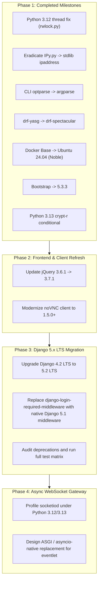

# WebVirtCloud - Dependency Upgrade & Modernization Plan

This document outlines the dependency audit, completed technical debt resolution, and future modernization roadmap for the WebVirtCloud project. It covers Python 3.12/3.13 compatibility, framework migrations, frontend libraries, and container base images.

---

## 1. Executive Summary & Compatibility Status

WebVirtCloud has historically relied on libraries established during the Python 3.8 - 3.10 era. Recent efforts have systematically eliminated obsolete dependencies and removed breaking Python 3.12 incompatibilities.

### Current Compatibility Baseline

| Component | Target Version | Status |
|---|---|---|
| **Python** | 3.10, 3.11, 3.12, 3.13 | ✅ Verified on 3.10–3.12; 3.13 ready (`crypt-r` conditional) |
| **Operating Systems** | Ubuntu 22.04/24.04, Debian 12, Rocky/RHEL 9/10 | ✅ Validated across modern enterprise Linux distros |
| **Django** | 4.2.23 (LTS) | ✅ Active (Supported through April 2026) |
| **OpenAPI / Swagger** | OpenAPI 3.0 (`drf-spectacular`) | ✅ Replaced legacy Swagger 2.0 (`drf-yasg`) |
| **Container Base** | `phusion/baseimage:noble-1.0.2` (Ubuntu 24.04 LTS) | ✅ Upgraded from Jammy (22.04) |

---

## 2. Completed Milestones & Resolved Technical Debt

The following table summarizes items that have been fully resolved in the codebase:

| Component / File | Previous State | Current State | Impact & Resolution |
|---|---|---|---|
| **`vrtManager/rwlock.py`** | Used removed `threading.currentThread()` | Updated to `threading.current_thread()` | **Critical Bugfix**: Resolved fatal `ImportError` on Python 3.12+. |
| **`rwlock==0.0.7`** | Listed in `conf/requirements.txt` | **Removed** | **Cleanup**: Package was abandoned in 2014; codebase uses local `vrtManager/rwlock.py`. |
| **`vrtManager/IPy.py`** | 1,650 lines of vendored IPy 1.01 (2011) | Replaced with stdlib `ipaddress` | **Maintenance**: Removed unmaintained legacy code, improved IP parsing performance, and added 15 regression unit tests. |
| **`console/novncd` & `socketiod`** | Used deprecated `optparse` | Migrated to standard `argparse` | **Modernization**: Full CLI argument parsing compliance with modern Python standard library. |
| **API Documentation** | `drf-yasg==1.21.10` (Swagger 2.0) | Migrated to `drf-spectacular[sidecar]==0.28.0` | **Modernization**: Upgraded to OpenAPI 3.0 with offline/air-gapped Swagger UI and Redoc sidecar assets. |
| **`Dockerfile` Base Image** | `phusion/baseimage:jammy-1.0.1` (Ubuntu 22.04) | `phusion/baseimage:noble-1.0.2` (Ubuntu 24.04 LTS) | **Infrastructure**: Brings modern system libraries (`libvirt 10.0+`, OpenSSL 3.0+, GCC 13+). |
| **Bootstrap** | Bootstrap 5.2.2 | Upgraded to Bootstrap 5.3.3 | **Frontend**: CSS variables support, form accessibility improvements, and dark mode foundations. |
| **Python 3.13 Crypt Support** | Stdlib `crypt` module removed in 3.13 | `crypt-r>=3.13.0; python_version >= "3.13"` | **Future-proofing**: Added conditional fallback dependency for root password hashing in `vrtManager/create.py`. |
| **LDAP Dependency** | Unconditional `python-ldap` import | Optional / graceful degradation | **Cross-Platform**: WebVirtCloud boots cleanly on minimal hosts without requiring C-header LDAP compilation. |

---

## 3. Pending & Future Roadmap

The following tasks represent future upgrade phases prioritized by maintenance schedules and architectural value.

### 3.1. Django 5.x LTS Roadmap (Django 4.2 LTS -> Django 5.2 LTS)

- **Priority**: High (Before April 2026)
- **Current State**: Django `4.2.23` LTS (supported until April 2026).
- **Target State**: Django `5.2` LTS (scheduled for release in April 2025 with support through April 2028).

#### Action Items:
1. **Retire `django-login-required-middleware`**:
   - The third-party package `django-login-required-middleware==0.9.0` has not been updated since 2017.
   - Django 5.1 introduced native `django.contrib.auth.middleware.LoginRequiredMiddleware`.
   - Once upgraded to Django 5.1+, remove the third-party package from `INSTALLED_APPS`, `MIDDLEWARE`, and `requirements.txt`.
2. **Deprecation Warnings Audit**:
   - Run test suite with `-Wd` flag to identify deprecated features prior to stepping to 5.x.
   - Verify compatibility of all database backends (SQLite, MySQL/MariaDB, PostgreSQL).
3. **Form Rendering and Async ORM**:
   - Leverage Django 5 form field templates and expanded async ORM capabilities where appropriate.

---

### 3.2. Asynchronous Console Architecture: `eventlet` Evaluation

- **Priority**: Medium / Long-term
- **Current State**: `socketiod` utilizes `eventlet==0.40.1` for WebSocket concurrency.
- **Risk Analysis**:
  - `eventlet` is in minimal maintenance and relies on monkey-patching CPython primitives.
  - Python 3.12 and 3.13 changes to internal frames and `greenlet` have historically produced runtime instability with monkey-patching frameworks.
- **Proposed Architecture**:
  - Evaluate migrating `socketiod` to modern ASGI or asyncio-native WebSocket architectures (e.g., standard Python `websockets`, `aiohttp`, or Django Channels).
  - Alternatively, evaluate encapsulating console proxying within a lightweight dedicated gateway (e.g., Go/Rust WebSocket proxy or native Nginx WebSocket passthrough).

---

### 3.3. noVNC Modernization (1.5.0+)

- **Priority**: Medium
- **Current State**: Vendored noVNC assets in `static/js/novnc/` date from the 2020 release.
- **Target State**: noVNC `1.5.0` or latest stable release.
- **Benefits**:
  - Robust auto-reconnect logic on transient network loss.
  - Enhanced mobile and touch-screen trackpad / gesture emulation.
  - Performance improvements in canvas rendering via modern WebGL/Canvas APIs.
  - Improved clipboard and audio streaming support.

---

### 3.4. Frontend Maintenance: jQuery Update

- **Priority**: Low / Maintenance
- **Current State**: `jQuery 3.6.1` (bundled in `static/js/jquery.min.js`).
- **Target State**: `jQuery 3.7.1`.
- **Benefits**:
  - Bug fixes in selector parsing and event delegation.
  - Elimination of known CVEs in legacy utility methods.

---

## 4. Phase-by-Phase Execution Timeline



---

## 5. Support & Compatibility Matrix

| Distribution / Environment | Python Version | Libvirt Python | Status |
|---|---|---|---|
| **Ubuntu 22.04 LTS (Jammy)** | 3.10 | 8.0.0+ | Fully Supported |
| **Ubuntu 24.04 LTS (Noble)** | 3.12 | 10.0.0+ | Fully Supported (Recommended Docker Base) |
| **Debian 12 (Bookworm)** | 3.11 | 9.0.0+ | Fully Supported |
| **Rocky Linux / RHEL 9** | 3.9 / 3.11 | 9.0.0+ | Fully Supported |
| **Rocky Linux / RHEL 10** | 3.12 | 11.0.0+ | Fully Supported |
| **Docker (Production Image)** | 3.12 (Noble base) | Bundled | Primary Supported Container Target |

---

## 6. Verification and CI Guidelines

Whenever dependencies are upgraded, the following verification pipeline must pass:

1. **Syntax & Unit Tests**:
   ```bash
   pytest
   # or
   python3 manage.py test
   ```
2. **Schema & Check Validations**:
   ```bash
   python3 manage.py check --deploy
   python3 manage.py spectacular --file /tmp/schema.yml --validate
   ```
3. **Multi-Platform CI**:
   - Ensure GitHub Actions workflow (`.github/workflows/linter.yml` and testing workflows) run on Python 3.10, 3.11, and 3.12.
