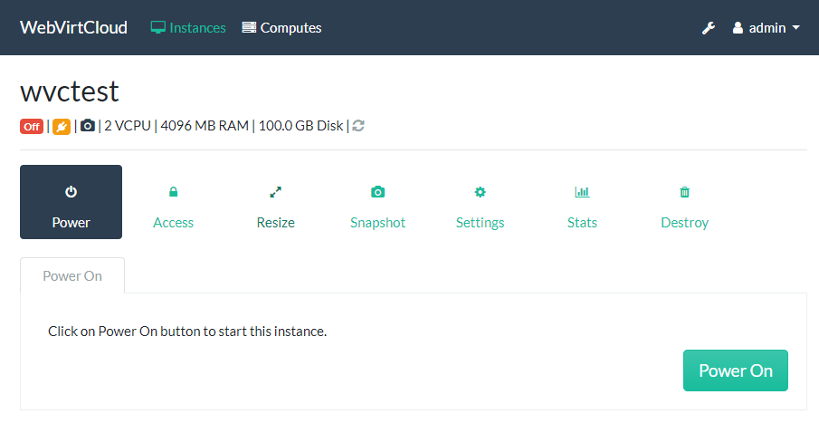
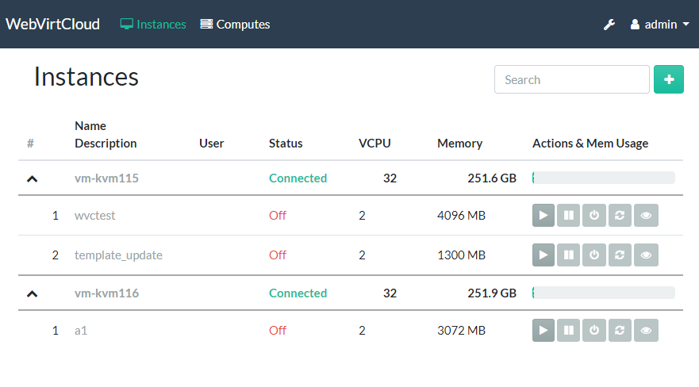
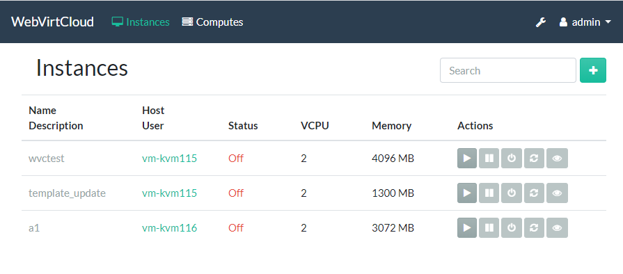
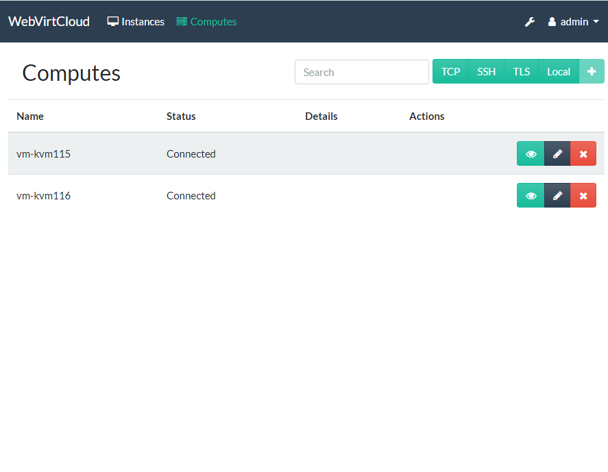
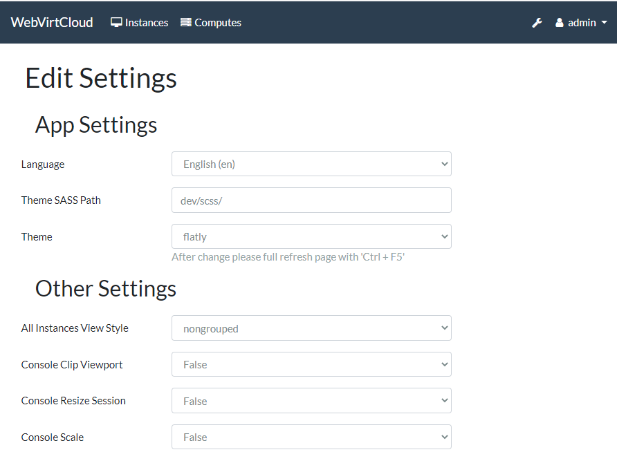

## WebVirtCloud


## Features
* QEMU/KVM Hypervisor Management
* QEMU/KVM Instance Management - Create, Delete, Update
* Hypervisor & Instance web based stats
* Manage Multiple QEMU/KVM Hypervisor
* Manage Hypervisor Datastore pools
* Manage Hypervisor Networks
* Instance Console Access with Browsers
* Libvirt API based web management UI
* User Based Authorization and Authentication 
* User can add SSH public key to root in Instance (Tested only Ubuntu)
* User can change root password in Instance (Tested only Ubuntu)
* Supports cloud-init datasource interface
 

### Warning!!!

How to update <code>gstfsd</code> daemon on hypervisor:

```bash
wget -O - https://clck.ru/9VMRH | sudo tee -a /usr/local/bin/gstfsd
sudo service supervisor restart
```

### Description

WebVirtCloud is a virtualization web interface for admins and users. It can delegate Virtual Machine's to users. A noVNC viewer presents a full graphical console to the guest domain.  KVM is currently the only hypervisor supported.

### Generate secret key
You should generate SECRET_KEY after cloning repo. Then put it into webvirtcloud/settings.py.

```python
import random, string
haystack = string.ascii_letters + string.digits + string.punctuation
print(''.join([random.SystemRandom().choice(haystack) for _ in range(50)]))
```

### Install WebVirtCloud panel (Ubuntu)

```bash
sudo apt-get -y install git virtualenv python-virtualenv python-dev python-lxml libvirt-dev zlib1g-dev libxslt1-dev nginx supervisor libsasl2-modules gcc pkg-config python-guestfs
git clone https://github.com/retspen/webvirtcloud
cd webvirtcloud
cp webvirtcloud/settings.py.template webvirtcloud/settings.py
# now put secret key to webvirtcloud/settings.py
sudo cp conf/supervisor/webvirtcloud.conf /etc/supervisor/conf.d
sudo cp conf/nginx/webvirtcloud.conf /etc/nginx/conf.d
cd ..
sudo mv webvirtcloud /srv
sudo chown -R www-data:www-data /srv/webvirtcloud
cd /srv/webvirtcloud
virtualenv venv
source venv/bin/activate
pip install -r conf/requirements.txt
python manage.py migrate
sudo chown -R www-data:www-data /srv/webvirtcloud
sudo rm /etc/nginx/sites-enabled/default
```

Restart services for running WebVirtCloud:

```bash
sudo service nginx restart
sudo service supervisor restart
```

Setup libvirt and KVM on server

```bash
wget -O - https://clck.ru/9V9fH | sudo sh
```

### Install WebVirtCloud panel (CentOS)

```bash
sudo yum -y install python-virtualenv python-devel libvirt-devel glibc gcc nginx supervisor python-lxml git python-libguestfs iproute-tc
```

#### Creating directories and cloning repo

```bash
sudo mkdir /srv && cd /srv
sudo git clone https://github.com/retspen/webvirtcloud && cd webvirtcloud
cp webvirtcloud/settings.py.template webvirtcloud/settings.py
# now put secret key to webvirtcloud/settings.py
```

#### Start installation webvirtcloud
```
sudo virtualenv venv
sudo source venv/bin/activate
sudo venv/bin/pip install -r conf/requirements.txt
sudo cp conf/nginx/webvirtcloud.conf /etc/nginx/conf.d/
sudo venv/bin/python manage.py migrate
```

#### Configure the supervisor for CentOS
Add the following after the [include] line (after **files = ... ** actually):
```bash
sudo vim /etc/supervisord.conf

[program:webvirtcloud]
command=/srv/webvirtcloud/venv/bin/gunicorn webvirtcloud.wsgi:application -c /srv/webvirtcloud/gunicorn.conf.py
directory=/srv/webvirtcloud
user=nginx
autostart=true
autorestart=true
redirect_stderr=true

[program:novncd]
command=/srv/webvirtcloud/venv/bin/python /srv/webvirtcloud/console/novncd
directory=/srv/webvirtcloud
user=nginx
autostart=true
autorestart=true
redirect_stderr=true
```

#### Edit the nginx.conf file
You will need to edit the main nginx.conf file as the one that comes from the rpm's will not work. Comment the following lines:

```
#    server {
#        listen       80 default_server;
#        listen       [::]:80 default_server;
#        server_name  _;
#        root         /usr/share/nginx/html;
#
#        # Load configuration files for the default server block.
#        include /etc/nginx/default.d/*.conf;
#
#        location / {
#        }
#
#        error_page 404 /404.html;
#            location = /40x.html {
#        }
#
#        error_page 500 502 503 504 /50x.html;
#            location = /50x.html {
#        }
#    }
}
```

Also make sure file in **/etc/nginx/conf.d/webvirtcloud.conf** has the proper paths:
```
upstream gunicorn_server {
    #server unix:/srv/webvirtcloud/venv/wvcloud.socket fail_timeout=0;
    server 127.0.0.1:8000 fail_timeout=0;
}
server {
    listen 80;

    server_name servername.domain.com;
    access_log /var/log/nginx/webvirtcloud-access_log; 

    location /static/ {
        root /srv/webvirtcloud;
        expires max;
    }

    location / {
        proxy_pass http://gunicorn_server;
        proxy_set_header X-Real-IP $remote_addr;
        proxy_set_header X-Forwarded-for $proxy_add_x_forwarded_for;
        proxy_set_header Host $host:$server_port;
        proxy_set_header X-Forwarded-Proto $remote_addr;
        proxy_connect_timeout 600;
        proxy_read_timeout 600;
        proxy_send_timeout 600;
        client_max_body_size 1024M;
    }
}
```

Change permissions so nginx can read the webvirtcloud folder:

```bash
sudo chown -R nginx:nginx /srv/webvirtcloud
```

Change permission for selinux:

```bash
sudo semanage fcontext -a -t httpd_sys_content_t "/srv/webvirtcloud(/.*)"
```

Add required user to the kvm group:
```bash
sudo usermod -G kvm -a webvirtmgr
```

Let's restart nginx and the supervisord services:
```bash
sudo systemctl restart nginx && systemctl restart supervisord
```

And finally, check everything is running:
```bash
sudo supervisorctl status
gstfsd             RUNNING   pid 24662, uptime 6:01:40
novncd             RUNNING   pid 24661, uptime 6:01:40
webvirtcloud       RUNNING   pid 24660, uptime 6:01:40
```

#### Apache mod_wsgi configuration
```
WSGIDaemonProcess webvirtcloud threads=2 maximum-requests=1000 display-name=webvirtcloud
WSGIScriptAlias / /srv/webvirtcloud/webvirtcloud/wsgi_custom.py
```

#### Install final required packages for libvirtd and others on Host Server
```bash
wget -O - https://clck.ru/9V9fH | sudo sh
```

Done!!

Go to http://serverip and you should see the login screen.

### Alternative running novncd via runit
Alternative to running nonvcd via supervisor is runit.

On Debian systems install runit and configure novncd service
```
apt install runit runit-systemd
mkdir /etc/service/novncd/
ln -s /srv/webvirtcloud/conf/runit/novncd.sh /etc/service/novncd/run
systemctl start runit.service
```

### Default credentials
<pre>
login: admin
password: admin
</pre>

### Configuring Compute SSH connection
This is a short example of configuring cloud and compute side of the ssh connection.

On the webvirtcloud machine you need to generate ssh keys and optionally disable StrictHostKeyChecking.
```
chown www-data -R ~www-data
sudo -u www-data ssh-keygen
cat > ~www-data/.ssh/config << EOF
Host *
StrictHostKeyChecking no
EOF
chown www-data -R ~www-data/.ssh/config
```

You need to put cloud public key into authorized keys on the compute node. Simpliest way of doing this is to use ssh tool from the webvirtcloud server.
```
sudo -u www-data ssh-copy-id root@compute1
```

### Cloud-init
Currently supports only root ssh authorized keys and hostname. Example configuration of the cloud-init client follows.
```
datasource:
  OpenStack:
      metadata_urls: [ "http://webvirtcloud.domain.com/datasource" ]
```

### How To Update
```bash
sudo virtualenv venv
sudo source venv/bin/activate
git pull
pip install -U -r conf/requirements.txt 
python manage.py migrate
sudo service supervisor restart
```
### Screenshots
Instance Detail:

Instance List:</br>


Other: </br>



### License

WebVirtCloud is licensed under the [Apache Licence, Version 2.0](http://www.apache.org/licenses/LICENSE-2.0.html).
