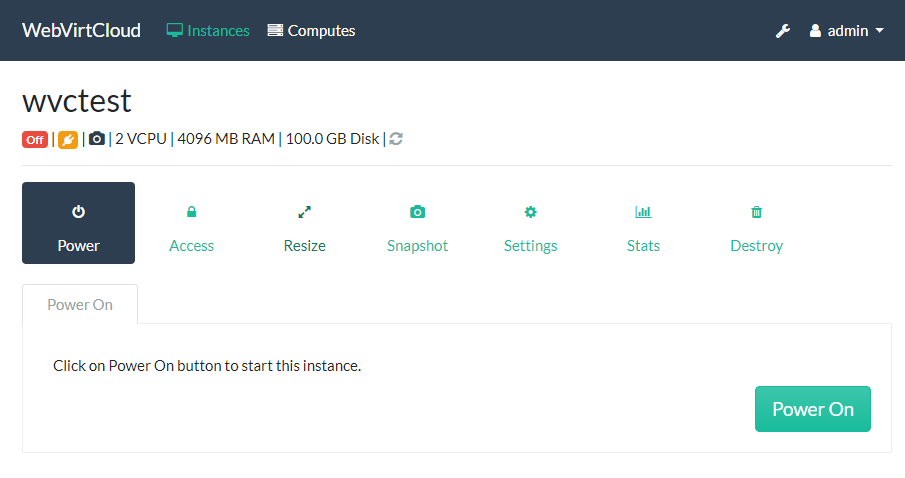
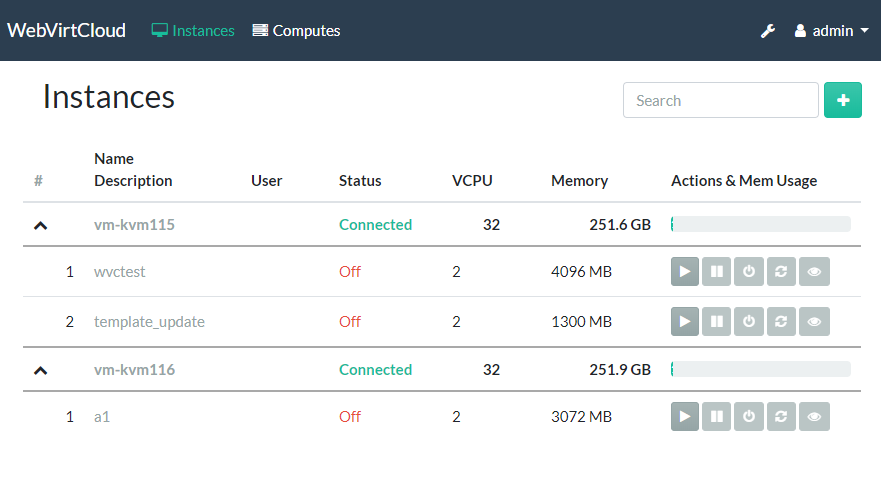
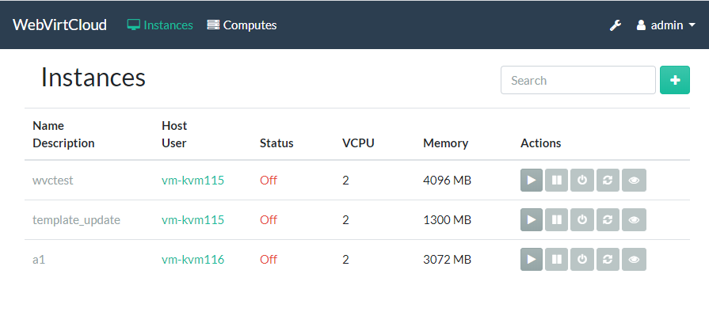
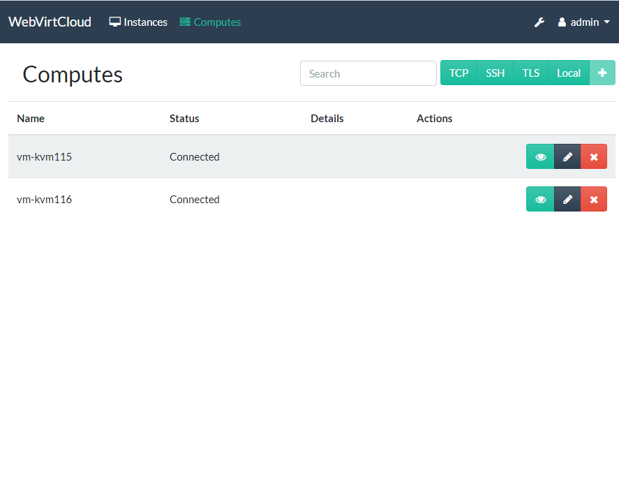
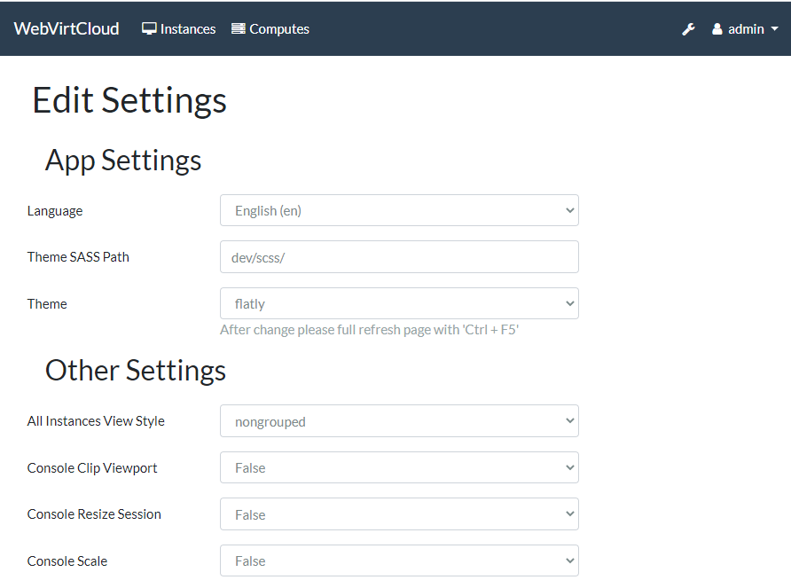

[](https://gitpod.io/#https://github.com/retspen/webvirtcloud)

# WebVirtCloud
###### Python >=3.10 & Django 4.2 LTS (tested on Python 3.10 – 3.12)

## Description

WebVirtCloud is a virtualization web interface for administrators and users. It allows delegating virtual machines to users with role-based permissions. A built-in noVNC / SPICE console presents a full graphical interface to the guest domain. KVM is currently the supported hypervisor.

## Features
* QEMU/KVM Hypervisor Management
* QEMU/KVM Instance Management - Create, Delete, Update
* Hypervisor & Instance web-based real-time stats
* Manage Multiple QEMU/KVM Hypervisors
* Manage Hypervisor Datastore pools and storage volumes
* Manage Hypervisor Networks and interfaces
* Instance Console Access with Web Browsers (noVNC & SPICE)
* Libvirt API-based web management UI
* User-based Authorization, Authentication, and 2FA (OTP)
* User can add SSH public key to root in Instance
* User can change root password in Instance
* Supports cloud-init datasource interface
* REST API with OpenAPI 3.0 (Swagger & ReDoc) documentation

## Quick Install with Installer (Beta)

Install an OS and run specified commands. Installer supported OSes: Ubuntu 20.04/22.04/24.04, Debian 10/11/12, Rocky/Alma/OEL/RHEL 9/10, openSUSE Leap 15.x / Tumbleweed, and SLES 15.
It can be installed on a virtual machine, physical host or on a KVM host.

```bash
# Using curl:
curl -fsSL -O https://raw.githubusercontent.com/retspen/webvirtcloud/master/install.sh
# Or using wget:
# wget https://raw.githubusercontent.com/retspen/webvirtcloud/master/install.sh

chmod 744 install.sh
# run with sudo or root user
./install.sh
```

## Docker Deployment (Docker Compose)

Run WebVirtCloud in a container with persistent volumes for data and SSH keys:

```bash
# 1. Clone repository:
git clone https://github.com/retspen/webvirtcloud
cd webvirtcloud

# 2. Start services:
docker compose up -d
```

Access the panel at `http://<server-ip>` and noVNC console at port `6080`.

## Manual Installation

### Generate secret key

You should generate SECRET_KEY after cloning repository. Then put it into webvirtcloud/settings.py.

```bash
python3 -c 'import secrets; print(secrets.token_urlsafe(50))'
```

### Ubuntu 20.04 / 22.04 / 24.04 LTS & Debian 11 / 12

```bash
# 1. Install system prerequisites
sudo apt-get update && sudo apt-get -y install git python3-venv python3-dev python3-lxml python3-libvirt libvirt-dev zlib1g-dev libxslt1-dev nginx supervisor libsasl2-modules gcc pkg-config python3-guestfs libsasl2-dev libldap2-dev libssl-dev

# 2. Clone repository to /srv/webvirtcloud
sudo git clone https://github.com/retspen/webvirtcloud /srv/webvirtcloud
cd /srv/webvirtcloud

# 3. Configure settings
cp webvirtcloud/settings.py.template webvirtcloud/settings.py
SECRET_KEY=$(python3 -c 'import secrets; print(secrets.token_urlsafe(50))')
sed -i "s|^SECRET_KEY = .*|SECRET_KEY = \"${SECRET_KEY}\"|" webvirtcloud/settings.py

# 4. Deploy service configurations
sudo cp conf/supervisor/webvirtcloud.conf /etc/supervisor/conf.d/
sudo cp conf/nginx/webvirtcloud.conf /etc/nginx/conf.d/
sudo rm -f /etc/nginx/sites-enabled/default

# 5. Create virtual environment and install dependencies
python3 -m venv --system-site-packages venv
source venv/bin/activate
pip install -r conf/requirements.txt

# 6. Database migrations and static files
python3 manage.py migrate
python3 manage.py collectstatic --noinput

# 7. Set permissions and start services
sudo chown -R www-data:www-data /srv/webvirtcloud
sudo systemctl restart nginx supervisor
```

---

### RHEL 8 / 9 / 10 / Rocky Linux / AlmaLinux

```bash
# 1. Install EPEL and system prerequisites
sudo dnf -y install epel-release
sudo dnf -y install git python3-devel libvirt-devel python3-libvirt python3-ldap python3-lxml cyrus-sasl-devel cyrus-sasl-md5 openldap-devel openssl-devel glibc gcc nginx supervisor python3-libguestfs iproute-tc

# 2. Clone repository to /srv/webvirtcloud
sudo git clone https://github.com/retspen/webvirtcloud /srv/webvirtcloud
cd /srv/webvirtcloud

# 3. Configure settings
cp webvirtcloud/settings.py.template webvirtcloud/settings.py
SECRET_KEY=$(python3 conf/runit/secret_generator.py)
sed -i "s|^SECRET_KEY = .*|SECRET_KEY = \"${SECRET_KEY}\"|" webvirtcloud/settings.py

# 4. Create virtual environment and install dependencies
python3 -m venv --system-site-packages venv
source venv/bin/activate
pip install -r conf/requirements.txt

# 5. Database migrations and static files
python3 manage.py migrate
python3 manage.py collectstatic --noinput

# 6. Configure Supervisor
sudo tee /etc/supervisord.d/webvirtcloud.ini > /dev/null << 'EOF'
[program:webvirtcloud]
command=/srv/webvirtcloud/venv/bin/gunicorn webvirtcloud.wsgi:application -c /srv/webvirtcloud/gunicorn.conf.py
directory=/srv/webvirtcloud
user=nginx
autostart=true
autorestart=true
redirect_stderr=true

[program:novncd]
command=/srv/webvirtcloud/venv/bin/python3 /srv/webvirtcloud/console/novncd
directory=/srv/webvirtcloud
user=nginx
autostart=true
autorestart=true
redirect_stderr=true
EOF

# 7. Configure Nginx
sudo cp conf/nginx/webvirtcloud.conf /etc/nginx/conf.d/
# Ensure the default server block in /etc/nginx/nginx.conf does not conflict with webvirtcloud.conf

# 8. Set permissions, SELinux, and Firewall
sudo chown -R nginx:nginx /srv/webvirtcloud
sudo semanage fcontext -a -t httpd_sys_content_t "/srv/webvirtcloud(/.*)" 2>/dev/null || true
sudo restorecon -R /srv/webvirtcloud 2>/dev/null || true
sudo setsebool -P httpd_can_network_connect on 2>/dev/null || true

sudo firewall-cmd --add-service=http --permanent 2>/dev/null || true
sudo firewall-cmd --add-port=6080/tcp --permanent 2>/dev/null || true
sudo firewall-cmd --reload 2>/dev/null || true

# 9. Start and enable services
sudo systemctl enable --now nginx supervisord
sudo systemctl restart nginx supervisord
```

---

### openSUSE Leap 15.x / Tumbleweed / SLES 15

```bash
# 1. Install system prerequisites (Python 3.11 stack and C bindings)
sudo zypper --non-interactive install -y git hostname python311 python311-base python311-devel python311-pip python311-libvirt-python python311-lxml python311-ldap libvirt-devel cyrus-sasl-devel libopenssl-devel gcc pkg-config nginx

# 2. Clone repository to /srv/webvirtcloud
sudo git clone https://github.com/retspen/webvirtcloud /srv/webvirtcloud
cd /srv/webvirtcloud

# 3. Configure settings
cp webvirtcloud/settings.py.template webvirtcloud/settings.py
SECRET_KEY=$(python3.11 conf/runit/secret_generator.py)
sed -i "s|^SECRET_KEY = .*|SECRET_KEY = \"${SECRET_KEY}\"|" webvirtcloud/settings.py

# 4. Create virtual environment and install dependencies
python3.11 -m venv --system-site-packages venv
source venv/bin/activate
pip install -r conf/requirements.txt

# 5. Database migrations and static files
python3 manage.py migrate
python3 manage.py collectstatic --noinput

# 6. Configure Nginx and Supervisor
sudo cp conf/nginx/suse_nginx.conf /etc/nginx/vhosts.d/webvirtcloud.conf 2>/dev/null || sudo cp conf/nginx/webvirtcloud.conf /etc/nginx/conf.d/
sudo chown -R nginx:nginx /srv/webvirtcloud

# 7. Start services
sudo systemctl enable --now nginx
sudo systemctl restart nginx
```

---

## Local Development Setup

For developers working locally on WebVirtCloud without running full production services:

### Rocky Linux / RHEL / Fedora
```bash
# 1. Install system prerequisites and precompiled bindings
sudo dnf -y install python3-devel libvirt-devel python3-libvirt python3-ldap python3-lxml gcc git

# 2. Create virtual environment with system site packages (enables zero-compilation install)
python3 -m venv --system-site-packages .venv
source .venv/bin/activate

# 3. Install Python dependencies
pip install -r conf/requirements.txt
pip install -r dev/requirements.txt

# 4. Initialize configuration and run local dev server
cp webvirtcloud/settings.py.template webvirtcloud/settings.py
sed -i -E 's/SECRET_KEY = .*/SECRET_KEY = "'$(python3 conf/runit/secret_generator.py)'"/' webvirtcloud/settings.py
python manage.py migrate
python manage.py runserver 0.0.0.0:8000
```

### Ubuntu / Debian
```bash
# 1. Install system prerequisites
sudo apt-get update && sudo apt-get -y install git python3-venv python3-dev python3-lxml python3-libvirt libvirt-dev zlib1g-dev libldap2-dev libsasl2-dev gcc pkg-config

# 2. Create virtual environment
python3 -m venv --system-site-packages .venv
source .venv/bin/activate

# 3. Install Python dependencies
pip install -r conf/requirements.txt
pip install -r dev/requirements.txt

# 4. Initialize configuration and run local dev server
cp webvirtcloud/settings.py.template webvirtcloud/settings.py
sed -i -E 's/SECRET_KEY = .*/SECRET_KEY = "'$(python3 conf/runit/secret_generator.py)'"/' webvirtcloud/settings.py
python manage.py migrate
python manage.py runserver 0.0.0.0:8000
```

### openSUSE Leap 15.x / Tumbleweed / SLES 15
```bash
# 1. Install system prerequisites
sudo zypper --non-interactive install -y git hostname python311 python311-base python311-devel python311-pip python311-libvirt-python python311-lxml python311-ldap libvirt-devel cyrus-sasl-devel libopenssl-devel gcc pkg-config

# 2. Create virtual environment with system site packages
python3.11 -m venv --system-site-packages .venv
source .venv/bin/activate

# 3. Install Python dependencies
pip install -r conf/requirements.txt
pip install -r dev/requirements.txt

# 4. Initialize configuration and run local dev server
cp webvirtcloud/settings.py.template webvirtcloud/settings.py
sed -i -E 's/SECRET_KEY = .*/SECRET_KEY = "'$(python3.11 conf/runit/secret_generator.py)'"/' webvirtcloud/settings.py
python manage.py migrate
python manage.py runserver 0.0.0.0:8000
```

## Compute Node (Hypervisor) Setup

To configure a physical server or virtual machine as a KVM compute node to be managed by WebVirtCloud:

### 1. Install KVM and Libvirt via Bootstrap Script

WebVirtCloud includes an automated bootstrap script supporting Ubuntu 20.04/22.04/24.04, Debian 10/11/12, RHEL/Rocky/Alma 8/9/10, openSUSE Leap 15.x / Tumbleweed, and SLES 15:

```bash
# Run bootstrap script directly via curl:
curl -fsSL https://raw.githubusercontent.com/retspen/webvirtcloud/master/dev/libvirt-bootstrap.sh | sudo sh

# Or run locally from a cloned repository:
sudo ./dev/libvirt-bootstrap.sh
```

### 2. Configure SSH Connection Between Panel and Compute Node

On the WebVirtCloud panel host, generate an SSH key for the web service user (`www-data` on Debian/Ubuntu, `nginx` on RHEL/openSUSE):

```bash
# Generate key (Debian/Ubuntu example using www-data):
sudo -u www-data ssh-keygen -t ed25519
sudo -u www-data tee ~www-data/.ssh/config > /dev/null << 'EOF'
Host *
  StrictHostKeyChecking no
EOF
sudo chmod 600 ~www-data/.ssh/config

# Copy public key to the compute node root user:
sudo -u www-data ssh-copy-id root@<compute-node-ip>
```

### 3. Install or Update `gstfsd` Daemon

The `gstfsd` daemon provides guest filesystem inspection and stats on hypervisors:

```bash
curl -fsSL https://raw.githubusercontent.com/retspen/webvirtcloud/master/conf/daemon/gstfsd | sudo tee /usr/local/bin/gstfsd > /dev/null
sudo chmod +x /usr/local/bin/gstfsd
sudo systemctl restart supervisor 2>/dev/null || sudo systemctl restart supervisord
```

### 4. Troubleshooting: Host SMBIOS Warning

If you see the warning `Unsupported configuration: Host SMBIOS information is not available`, install `dmidecode` and restart libvirt:

```bash
# Debian / Ubuntu:
sudo apt-get install -y dmidecode && sudo systemctl restart libvirtd

# RHEL / Rocky / AlmaLinux:
sudo dnf install -y dmidecode && sudo systemctl restart libvirtd

# openSUSE / SLES:
sudo zypper install -y dmidecode && sudo systemctl restart libvirtd
```

> **Security Notice (Compute Node Firewall):**
> Libvirt compute nodes listen on VNC/SPICE ports (`5900`–`65535`) to allow WebVirtCloud to proxy graphical consoles. Ensure your firewall (`ufw`, `firewalld`, or `iptables`) restricts these ports to accept connections **only** from the WebVirtCloud panel IP, and never exposes them directly to public networks.

---

## Configuration & Operational Notes

### Default Credentials

After initial installation, sign in to the web panel at `http://<server-ip>`:

```text
Username: admin
Password: admin
```
> **Security Notice:** Change the default administrator password immediately after first login.

### Alternative: Running novncd via runit (Debian)

As an alternative to Supervisor, Debian systems can manage `novncd` via `runit`:

```bash
sudo apt install -y runit runit-systemd
sudo mkdir -p /etc/service/novncd/
sudo ln -s /srv/webvirtcloud/conf/runit/novncd.sh /etc/service/novncd/run
sudo systemctl start runit.service
```

### Cloud-Init Datasource

WebVirtCloud can serve cloud-init metadata (root SSH keys and hostname) to guest instances:

```yaml
datasource:
  OpenStack:
    metadata_urls: [ "http://webvirtcloud.domain.com/datasource" ]
```

### Reverse-Proxy & Port Forwarding

If WebVirtCloud runs behind a reverse proxy terminating SSL or forwarding port 80/443, configure `WS_PUBLIC_PORT` in `webvirtcloud/settings.py` (default: 6080):

```python
WS_PUBLIC_PORT = 80  # or 443
```

## How To Update

```bash
# Go to Installation Directory
cd /srv/webvirtcloud
source venv/bin/activate
git pull
pip3 install -U -r conf/requirements.txt 
python3 manage.py migrate
python3 manage.py collectstatic --noinput
sudo service supervisor restart
```

> **Note on Settings Upgrade:**
> When upgrading from earlier versions using `drf-yasg`, update your `webvirtcloud/settings.py`:
> 1. In `INSTALLED_APPS`, replace `'drf_yasg'` with `'drf_spectacular'` and `'drf_spectacular_sidecar'`.
> 2. Ensure the `REST_FRAMEWORK` and `SPECTACULAR_SETTINGS` configuration blocks are present (see `webvirtcloud/settings.py.template`).

## Running Tests

WebVirtCloud includes unit tests for both Django models/views and the `vrtManager` libvirt abstraction layer. The test suite uses isolated mock drivers by default and does not require a live KVM hypervisor.

### 1. Setup Virtual Environment
```bash
python3 -m venv .venv
source .venv/bin/activate
pip install -r conf/requirements.txt
pip install -r dev/requirements.txt
```

### 2. Run Test Suite
```bash
# Run Django test suite (accounts, admin, instances, logs, etc.):
python manage.py test

# Run vrtManager unit tests:
python -m unittest discover -s vrtManager -p "test_*.py"
```

> **Live Hypervisor Testing (Optional):**
> To run tests against a live libvirt host instead of standalone mocks, set the `WEBVIRTCLOUD_TEST_LIBVIRT_URI` environment variable before running tests:
> ```bash
> export WEBVIRTCLOUD_TEST_LIBVIRT_URI="qemu+ssh://root@compute1/system"
> python manage.py test
> ```

## LDAP Configuration

The config options below can be changed in `webvirtcloud/settings.py` file. Variants for Active Directory and OpenLDAP are shown. This is a minimal config to get LDAP running, for further info read the [django-auth-ldap documentation](https://django-auth-ldap.readthedocs.io).

Enable LDAP

```bash
sudo sed -i "s~#\"django_auth_ldap.backend.LDAPBackend\",~\"django_auth_ldap.backend.LDAPBackend\",~g" /srv/webvirtcloud/webvirtcloud/settings.py
```

Set the LDAP server name and bind DN

```python
# Active Directory
AUTH_LDAP_SERVER_URI = "ldap://example.com"
AUTH_LDAP_BIND_DN = "username@example.com"
AUTH_LDAP_BIND_PASSWORD = "password"

# OpenLDAP
AUTH_LDAP_SERVER_URI = "ldap://example.com"
AUTH_LDAP_BIND_DN = "CN=username,CN=Users,OU=example,OU=com"
AUTH_LDAP_BIND_PASSWORD = "password"
```

Set the user filter and user and group search base and filter

```python
# Active Directory
AUTH_LDAP_USER_SEARCH = LDAPSearch(
    "CN=Users,DC=example,DC=com", ldap.SCOPE_SUBTREE, "(sAMAccountName=%(user)s)"
)
AUTH_LDAP_GROUP_SEARCH = LDAPSearch(
    "CN=Users,DC=example,DC=com", ldap.SCOPE_SUBTREE, "(objectClass=group)"
)
AUTH_LDAP_GROUP_TYPE = NestedActiveDirectoryGroupType()

# OpenLDAP
AUTH_LDAP_USER_SEARCH = LDAPSearch(
    "CN=Users,DC=example,DC=com", ldap.SCOPE_SUBTREE, "(cn=%(user)s)"
)
AUTH_LDAP_GROUP_SEARCH = LDAPSearch(
    "CN=Users,DC=example,DC=com", ldap.SCOPE_SUBTREE, "(objectClass=groupOfUniqueNames)"
)
AUTH_LDAP_GROUP_TYPE = GroupOfUniqueNamesType()  # import needs to be changed at the top of settings.py
```

Set group which is required to access WebVirtCloud. You may set this to `False` to disable this filter.

```python
AUTH_LDAP_REQUIRE_GROUP = "CN=WebVirtCloud Access,CN=Users,DC=example,DC=com"
```

Populate user fields with values from LDAP

```python
AUTH_LDAP_USER_FLAGS_BY_GROUP = {
    "is_staff": "CN=WebVirtCloud Staff,CN=Users,DC=example,DC=com",
    "is_superuser": "CN=WebVirtCloud Admins,CN=Users,DC=example,DC=com",
}
AUTH_LDAP_USER_ATTR_MAP = {
    "first_name": "givenName",
    "last_name": "sn",
    "email": "mail",
}
```

Now when you login with an LDAP user it will be assigned the rights defined. The user will be authenticated then with LDAP and authorized through the WebVirtCloud permissions.

If you'd like to move a user from ldap to WebVirtCloud, just change its password from the UI and (eventually) remove from the group in LDAP.


## REST API (OpenAPI 3.0)

WebVirtCloud provides a REST API powered by Django REST Framework and documented via `drf-spectacular`.

You can access the interactive API documentation and schema endpoints in your browser:

* **Swagger UI:** `http://<webvirtcloud-address:port>/swagger/`
* **ReDoc UI:** `http://<webvirtcloud-address:port>/redoc/`
* **OpenAPI 3.0 Schema:** `http://<webvirtcloud-address:port>/api/schema/` (download schema in JSON or YAML format)

## Screenshots

| Instance Detail |
|:---:|
|  |

| Grouped Instances | Non-Grouped Instances |
|:---:|:---:|
|  |  |

| Compute Hosts | Activity Log |
|:---:|:---:|
|  |  |

## License

WebVirtCloud is licensed under the [Apache Licence, Version 2.0](http://www.apache.org/licenses/LICENSE-2.0.html).
