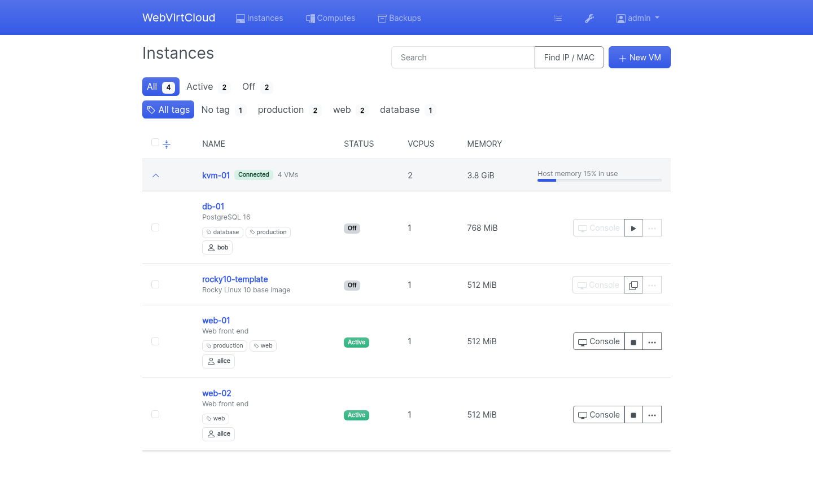
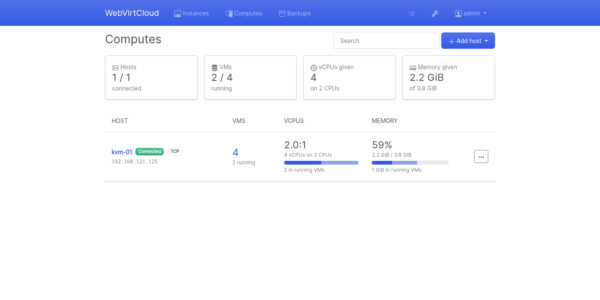
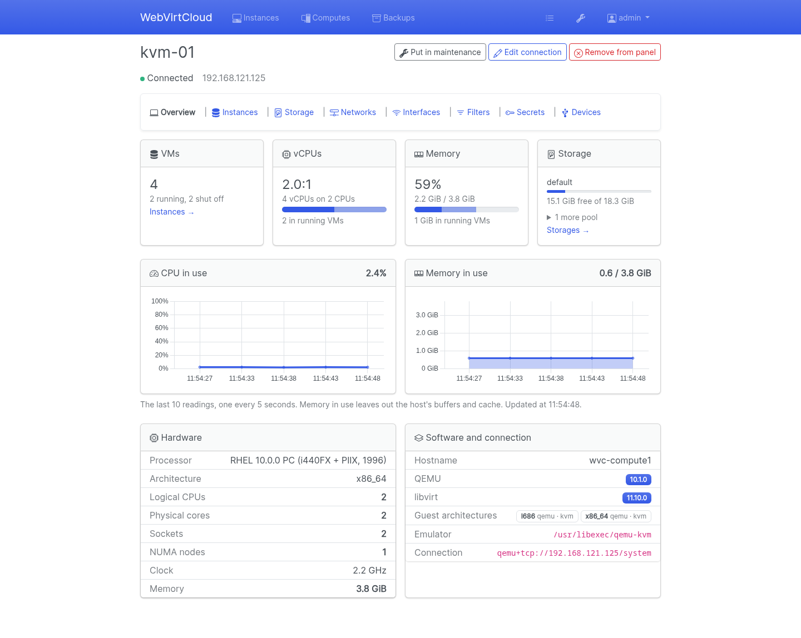

# WebVirtCloud
###### Python >=3.10 & Django 5.2 LTS (tested on Python 3.10 – 3.14)

WebVirtCloud is a **web visualization and management layer** for **libvirt**-based virtualization infrastructure.

> **libvirt is the single source of truth.** WebVirtCloud reads, displays and triggers actions on libvirt state, but it is never the primary orchestrator.

- An administrator can connect to libvirt directly with **`virt-manager`** or **`virsh`** and create, delete, rename or reconfigure virtual machines. WebVirtCloud detects these changes and updates its database accordingly.
- Virtual machines keep running **even when WebVirtCloud is stopped**; the application only reflects the current state of libvirt.
- WebVirtCloud is not a full automation platform like Proxmox. Its goal is to expose libvirt's functionality through the browser in an accessible, role-based and secure way.

```
┌─────────────────────────────────────────────────────┐
│               Administrator / User                  │
└────────────┬───────────────────┬────────────────────┘
             │ Web browser        │ virt-manager / virsh
             ▼                   ▼
┌────────────────────┐  ┌─────────────────────────────┐
│   WebVirtCloud     │  │   libvirt API (direct)      │
│   (web UI layer)   │◄─┤   — separate, independent   │
└────────┬───────────┘  └──────────────┬──────────────┘
         │ libvirt API                  │
         ▼                             ▼
┌──────────────────────────────────────────────────────┐
│               libvirtd (hypervisor daemon)           │
│                    QEMU / KVM                        │
└──────────────────────────────────────────────────────┘
```

WebVirtCloud and `virt-manager`/`virsh` can manage the same libvirt host **concurrently and independently**. WebVirtCloud picks up external changes the next time the instance list page is loaded.

## Features

* QEMU/KVM hypervisor management (multiple compute nodes), with each host's capacity and what its VMs were given
* Host maintenance: a host in maintenance takes no new VMs, incoming migrations or VM starts; putting it in maintenance offers to migrate its VMs away with Bulk Migrate
* Balance: proposes migrations that even out the running VMs' memory, then vCPUs, as a share of each host's size
* Virtual machine lifecycle: create, delete, power management, clone (also of a running VM, with libvirt 11.10 or later), migrate (with or without shared storage), bulk migrate (a host's chosen VMs to another host, the chosen number at once), disk moves between pools
* Long operations (create, clone, delete, bulk power, snapshots, migration, disk moves, ISO upload, downloads from a URL, VM backups) run as jobs that the page follows; a queued job can be cancelled, and a running migration, ISO upload, download, backup or verification and the copy of a running VM (clone, disk move) too
* External snapshots (memory optional; without memory, guest file systems can be frozen through the agent)
* **External change detection:** VMs created, deleted or renamed via `virt-manager` or `virsh` are reconciled into the database automatically
* Real-time host statistics (CPU, RAM) and VM statistics (CPU, RAM, disk, network)
* Storage pool and volume management; a superuser downloads a volume from its pool page (not one a running VM uses), or makes one from a file at a URL
* Network (with DHCP leases), interface, network filter and secret management
* PCI and USB devices of the host given to VMs
* UEFI Secure Boot and TPM 2.0 for new VMs, as Windows 11 needs
* Browser-based VNC console (noVNC) and serial console
* Role-based access control: users see the VMs assigned to them, within their quota; an auditor permission shows every VM read-only
* 2FA (OTP / TOTP) and failed-login lockout
* SSH public key and root password management (guest agent for a running VM, gstfsd for a shut-off one)
* Finding VMs by IP or MAC address, and a VM report as an Excel file
* Tags on VMs and hosts, set by superusers: the lists filter by them, Bulk Migrate chooses VMs by them and a backup schedule backs up every VM with a chosen tag (templates left out)
* Protected VMs, set by superusers on the VM's Settings tab: not deleted and not restored over until the protection is turned off
* An audit log of who changed what, with its result
* Cloud-init datasource interface (OpenStack metadata compatible) and NoCloud seed media
* REST API — OpenAPI 3.0 (Swagger & ReDoc), with API tokens
* LDAP / Active Directory integration (optional)
* VM backups, of a running or shut-off VM, into a storage pool of your choice; a backup is restored as a new VM, over its own shut-off VM, or one disk as a new volume
* Daily backups of the panel, with an optional off-site copy (restic over SFTP)
* English, Turkish and Simplified Chinese

## Contents

1. [Installation](#installation): [installer](#installer), [Docker](#docker), [manual](#manual-installation), [first login](#first-login)
2. [Adding a Compute Node](#adding-a-compute-node)
3. [Configuration](#configuration): [environment variables](#environment-variables), [local settings](#local-settings), [HTTPS and reverse proxy](#https-and-reverse-proxy), [cloud-init datasource](#cloud-init-datasource), [LDAP](#ldap), [OTP](#two-factor-login-otp), [serial console](#serial-console)
4. [Backups](#backups): [off-site copy](#off-site-copy), [VM backups](#vm-backups)
5. [Updating](#updating): [Docker](#docker-1), [installer and manual](#installer-and-manual-installation), [restore and rollback](#restore-and-rollback), [moving to a new machine](#moving-to-a-new-machine), [behavior changes](#behavior-changes)
6. [Usage](#usage): [users and permissions](#users-roles-and-permissions), [REST API](#rest-api), [screenshots](#screenshots)
7. [Development](#development)

## Installation

The installer supports Ubuntu 22.04 / 24.04 / 26.04, Debian 12 / 13, RHEL / Rocky Linux / AlmaLinux / Oracle Linux 10, openEuler 24.03 LTS, openSUSE Leap 15.x / 16.0 / Tumbleweed and SLES 15; the panel runs on a virtual machine, a physical host or a KVM host itself and needs Python 3.10 or newer. CI tests Python 3.10–3.14 on Ubuntu (sqlite, and PostgreSQL on 3.12), the Docker image, and the installer on Ubuntu 22.04 / 24.04 / 26.04, Debian 12 / 13, AlmaLinux 10, openEuler 24.03 and openSUSE Leap 15.6 / 16.0 (`dev/test-installer.sh`). Pick one of the three ways below, then do the [first login](#first-login).

### Installer

```bash
curl -fsSL -O https://raw.githubusercontent.com/retspen/webvirtcloud/master/install.sh
chmod 744 install.sh
sudo ./install.sh
```

The installer writes the server's names and IPs to `ALLOWED_HOSTS`. Running it again keeps `data/local_settings.py` (and its noVNC port, whatever the answer), the database, the secret key and the main nginx config, but replaces `/etc/nginx/conf.d/webvirtcloud.conf` and the systemd units; back up your own lines in the nginx config (TLS) first. Put your own service settings in `/etc/default/webvirtcloud` or in drop-ins (`systemctl edit webvirt-cloud`), which a re-run keeps.

### Docker

```bash
# 1. Clone repository:
git clone https://github.com/retspen/webvirtcloud
cd webvirtcloud

# 2. Set the names/IPs the panel is reached by (git pull never touches this file):
cat > docker-compose.override.yml <<'EOF'
services:
  webvirtcloud:
    environment:
      - ALLOWED_HOSTS=wvc.example.com,192.0.2.10
EOF

# 3. Start services:
docker compose up -d
```

The panel and its console are at `http://<server-ip>`. The database and secret key live in the `webvirtcloud-data` volume, the SSH keys in `webvirtcloud-ssh`, the TLS client certificates in `webvirtcloud-pki`, the [backups](#backups) in `webvirtcloud-backups`. Other settings go in the same `environment:` list, see [Environment variables](#environment-variables).

### Manual installation

Run the steps from a root shell (`sudo -i`). In step 3, replace the example `ALLOWED_HOSTS` with the names/IPs the panel (and the cloud-init datasource) is reached by.

The virtualenv is created with `--system-site-packages`: `libvirt-python` comes from the distro packages when its version satisfies `conf/requirements.txt`; otherwise pip builds it, which needs the `-dev`/`-devel` packages listed below. `lxml` is reused the same way; everything else comes from pip.

#### Ubuntu 22.04 / 24.04 / 26.04, Debian 12 / 13

```bash
# 1. System packages
apt-get update && apt-get -y install git python3-venv python3-dev python3-lxml python3-libvirt libvirt-dev zlib1g-dev libxslt1-dev nginx libsasl2-modules gcc pkg-config python3-guestfs libssl-dev

# 2. Code
git clone https://github.com/retspen/webvirtcloud /srv/webvirtcloud
cd /srv/webvirtcloud

# 3. This installation's settings (data/local_settings.py, see Configuration) and secret key
mkdir -p -m 700 data && (umask 077 &&
  echo 'ALLOWED_HOSTS += ["wvc.example.com", "192.0.2.10"]' > data/local_settings.py &&
  python3 conf/secret_generator.py > data/secret_key)

# 4. Virtualenv and dependencies
python3 -m venv --system-site-packages venv
source venv/bin/activate
pip install -r conf/requirements.txt

# 5. Database and static files (the first migrate creates the "admin" user)
python3 manage.py migrate
python3 manage.py collectstatic --noinput

# 6. systemd units (gunicorn, novncd, socketiod, the job worker and the daily backup) and nginx
cp conf/systemd/webvirt-{cloud,novncd,socketiod,worker,backup}.service conf/systemd/webvirt-backup.timer /etc/systemd/system/
cp conf/nginx/webvirtcloud.conf /etc/nginx/conf.d/
rm -f /etc/nginx/sites-enabled/default

# 7. Ownership, private files, start (the groups let the services reach a local libvirt and KVM)
chown -R www-data:www-data /srv/webvirtcloud
for g in libvirt kvm; do usermod -a -G $g www-data 2>/dev/null || true; done   # on a KVM host
chmod 700 data && chmod 600 data/local_settings.py data/secret_key && { [ ! -f db.sqlite3 ] || chmod 600 db.sqlite3; }
systemctl daemon-reload && systemctl enable --now webvirt-cloud webvirt-novncd webvirt-socketiod webvirt-worker webvirt-backup.timer
nginx -t && systemctl restart nginx
```

#### RHEL / Rocky Linux / AlmaLinux / Oracle Linux 10

```bash
# 1. System packages (libvirt-devel is in the CRB repository)
dnf -y install epel-release && crb enable   # Rocky / AlmaLinux; on RHEL and Oracle Linux enable their CodeReady Builder repository and EPEL as their documentation says
dnf -y install git python3-devel libvirt-devel python3-libvirt python3-lxml cyrus-sasl-md5 openssl-devel glibc gcc nginx python3-libguestfs iproute-tc policycoreutils-python-utils

# 2. Code
git clone https://github.com/retspen/webvirtcloud /srv/webvirtcloud
cd /srv/webvirtcloud

# 3. This installation's settings (data/local_settings.py, see Configuration) and secret key
mkdir -p -m 700 data && (umask 077 &&
  echo 'ALLOWED_HOSTS += ["wvc.example.com", "192.0.2.10"]' > data/local_settings.py &&
  python3 conf/secret_generator.py > data/secret_key)

# 4. Virtualenv and dependencies
python3 -m venv --system-site-packages venv
source venv/bin/activate
pip install -r conf/requirements.txt

# 5. Database and static files (the first migrate creates the "admin" user)
python3 manage.py migrate
python3 manage.py collectstatic --noinput

# 6. systemd units (gunicorn, novncd, socketiod, the job worker and the daily backup, as nginx) and nginx
for u in cloud novncd socketiod worker backup; do sed 's/^\(User\|Group\)=.*/\1=nginx/' conf/systemd/webvirt-$u.service > /etc/systemd/system/webvirt-$u.service; done
cp conf/systemd/webvirt-backup.timer /etc/systemd/system/
cp conf/nginx/webvirtcloud.conf /etc/nginx/conf.d/
# make sure the default server block in /etc/nginx/nginx.conf does not also listen on port 80

# 7. Ownership, private files, SELinux, firewall, start (the groups let the services reach a local libvirt and KVM)
chown -R nginx:nginx /srv/webvirtcloud
for g in libvirt kvm; do usermod -a -G $g nginx 2>/dev/null || true; done   # on a KVM host
chmod 700 data && chmod 600 data/local_settings.py data/secret_key && { [ ! -f db.sqlite3 ] || chmod 600 db.sqlite3; }
# nginx reads the static files, systemd runs the virtualenv's programs
semanage fcontext -a -t httpd_sys_content_t "/srv/webvirtcloud(/.*)?" 2>/dev/null || true
semanage fcontext -a -t bin_t "/srv/webvirtcloud/venv/bin(/.*)?" 2>/dev/null || true
restorecon -R /srv/webvirtcloud 2>/dev/null || true
setsebool -P httpd_can_network_connect on 2>/dev/null || true
firewall-cmd --add-service=http --permanent 2>/dev/null || true
firewall-cmd --reload 2>/dev/null || true
systemctl daemon-reload && systemctl enable --now webvirt-cloud webvirt-novncd webvirt-socketiod webvirt-worker webvirt-backup.timer
systemctl enable nginx && nginx -t && systemctl restart nginx
```

#### openSUSE Leap 15.x / 16.0 / Tumbleweed, SLES 15

On SLES 15, enable the Python 3 module and SUSE Package Hub first (`SUSEConnect -p sle-module-python3/15.7/x86_64` and `SUSEConnect -p PackageHub/15.7/x86_64`, with your service pack); the installer needs them too.

```bash
# 1. System packages (Python 3.11 stack; on Leap 16 and Tumbleweed python313-* packages and python3.13 below)
zypper --non-interactive install -y git hostname python311 python311-base python311-devel python311-pip python311-libvirt-python python311-lxml libvirt-devel libopenssl-devel gcc pkg-config nginx

# 2. Code
git clone https://github.com/retspen/webvirtcloud /srv/webvirtcloud
cd /srv/webvirtcloud

# 3. This installation's settings (data/local_settings.py, see Configuration) and secret key
mkdir -p -m 700 data && (umask 077 &&
  echo 'ALLOWED_HOSTS += ["wvc.example.com", "192.0.2.10"]' > data/local_settings.py &&
  python3.11 conf/secret_generator.py > data/secret_key)

# 4. Virtualenv and dependencies
python3.11 -m venv --system-site-packages venv
source venv/bin/activate
pip install -r conf/requirements.txt

# 5. Database and static files (the first migrate creates the "admin" user)
python3 manage.py migrate
python3 manage.py collectstatic --noinput

# 6. systemd units (gunicorn, novncd, socketiod, the job worker and the daily backup, as nginx) and nginx
for u in cloud novncd socketiod worker backup; do sed 's/^\(User\|Group\)=.*/\1=nginx/' conf/systemd/webvirt-$u.service > /etc/systemd/system/webvirt-$u.service; done
cp conf/systemd/webvirt-backup.timer /etc/systemd/system/
cp conf/nginx/webvirtcloud.conf /etc/nginx/conf.d/
# make sure the default server block in /etc/nginx/nginx.conf does not also listen on port 80

# 7. Ownership, private files, start (the groups let the services reach a local libvirt and KVM)
chown -R nginx:nginx /srv/webvirtcloud
for g in libvirt kvm; do usermod -a -G $g nginx 2>/dev/null || true; done   # on a KVM host
chmod 700 data && chmod 600 data/local_settings.py data/secret_key && { [ ! -f db.sqlite3 ] || chmod 600 db.sqlite3; }
systemctl daemon-reload && systemctl enable --now webvirt-cloud webvirt-novncd webvirt-socketiod webvirt-worker webvirt-backup.timer
systemctl enable nginx && nginx -t && systemctl restart nginx
```

### First login

The first `migrate` creates a superuser named `admin` with a random password, written to `data/admin_password` (mode 0600):

```bash
sudo cat /srv/webvirtcloud/data/admin_password            # installer or manual installation
docker compose exec webvirtcloud cat data/admin_password   # Docker
```

Sign in at `http://<server-ip>`; you must set a new password at the first login, and the file is then deleted. To choose the name or password yourself, set `ADMIN_USERNAME` and/or `ADMIN_PASSWORD` in the environment before that first `migrate`; a password you set is not written to the file and need not be changed. A lost password is reset from a root shell with `cd /srv/webvirtcloud && runuser -u www-data -- venv/bin/python3 manage.py changepassword admin` (`nginx` on RHEL / openSUSE; load `/etc/default/webvirtcloud` first if you use it, see [Environment variables](#environment-variables); Docker: `docker compose exec -u www-data webvirtcloud venv/bin/python3 manage.py changepassword admin`).

## Adding a Compute Node

A compute node is a KVM host the panel manages over libvirt.

1. Install KVM and libvirt. The bootstrap script handles Ubuntu, Debian, CentOS, Fedora, Rocky Linux and AlmaLinux 10, openEuler 24.03 LTS, openSUSE and SLES. On RHEL, which needs EPEL from its release RPM, install the `qemu-kvm`, `libvirt` and `python3-libguestfs` (for gstfsd, step 3) packages yourself and enable the sockets of the daemons the panel talks to, `virt{qemu,network,storage,nodedev,nwfilter,secret,interface}d.socket` (for TCP also `virtproxyd-tcp.socket` and SASL, set up as `dev/libvirt-bootstrap.sh` does on EL10):

   ```bash
   curl -fsSL https://raw.githubusercontent.com/retspen/webvirtcloud/master/dev/libvirt-bootstrap.sh | sudo sh
   # or, from a cloned repository: sudo sh ./dev/libvirt-bootstrap.sh
   ```

   The new VM form offers UEFI, UEFI Secure Boot (with Microsoft's keys, for Windows 11) and a TPM 2.0 only when the host's libvirt finds the UEFI firmware and swtpm: install `ovmf swtpm-tools` (Debian / Ubuntu) or `edk2-ovmf swtpm swtpm-tools` (RHEL family, openEuler) if they are missing.

2. For SSH connections, give the user the panel runs as an SSH key and copy it to the compute node. **Use only the block for your installation type:** a key set up with the host commands is not seen by the panel in Docker. `ssh-copy-id` asks for the compute node's root password once. `accept-new` accepts a new host's key on first connect and refuses a changed one.

   **Installer or manual installation**, on the panel host:

   ```bash
   U=www-data   # the web service user: www-data on Debian/Ubuntu, nginx on RHEL/openSUSE
   H=$(getent passwd $U | cut -d: -f6)
   sudo install -d -m 700 -o $U -g $U $H/.ssh
   sudo -u $U ssh-keygen -t ed25519 -N "" -f $H/.ssh/id_ed25519
   printf 'Host *\n  StrictHostKeyChecking accept-new\n' | sudo -u $U tee $H/.ssh/config > /dev/null
   sudo chmod 600 $H/.ssh/config
   sudo -u $U ssh-copy-id root@<compute-node-ip>
   sudo -u $U ssh root@<compute-node-ip> true   # no password or prompt: ready
   ```

   **Docker**, on the Docker host from the directory with `docker-compose.yml`; the commands run inside the container (always as `www-data`: the keys are kept in the `webvirtcloud-ssh` volume, and a key made as root is not used by the panel):

   ```bash
   docker compose exec -u www-data webvirtcloud ssh-keygen -t ed25519 -N "" -f /var/www/.ssh/id_ed25519
   docker compose exec -u www-data webvirtcloud sh -c 'printf "Host *\n  StrictHostKeyChecking accept-new\n" > ~/.ssh/config && chmod 600 ~/.ssh/config'
   docker compose exec -u www-data webvirtcloud ssh-copy-id root@<compute-node-ip>
   docker compose exec -u www-data webvirtcloud ssh root@<compute-node-ip> true   # no password or prompt: ready
   ```

   For TCP connections, the bootstrap script makes libvirt ask for a SASL login. Create it on the compute node and enter it, with its password, on the Computes page (`saslpasswd2` is in `sasl2-bin` on Debian / Ubuntu and in `cyrus-sasl` on the RHEL family):

   ```bash
   sudo saslpasswd2 -a libvirt <login>   # asks for its password
   ```

   For TLS connections, put the CA certificate and the panel's client certificate and key in the panel user's `~/.pki/libvirt/` as `cacert.pem`, `clientcert.pem` and `clientkey.pem`, readable only by that user: `$H/.pki/libvirt/` with the installer; in Docker `/var/www/.pki/libvirt/` (the `webvirtcloud-pki` volume), owned by `www-data`. On the compute node, install the same CA certificate and a server certificate whose subjectAltName is the address the panel uses, then let libvirt listen for TLS:

   ```bash
   sudo install -D -m 644 cacert.pem /etc/pki/CA/cacert.pem
   sudo install -D -m 644 servercert.pem /etc/pki/libvirt/servercert.pem
   sudo install -D -m 600 serverkey.pem /etc/pki/libvirt/private/serverkey.pem
   # RHEL family 10 (the modular daemons: the bootstrap enabled virtproxyd-tcp.socket):
   sudo systemctl stop virtproxyd.service; sudo systemctl enable --now virtproxyd-tls.socket
   # the other systems (libvirtd):
   sudo systemctl stop libvirtd.service; sudo systemctl enable --now libvirtd-tls.socket && sudo systemctl start libvirtd.service
   ```

3. Install or update the `gstfsd` daemon on the compute node (the bootstrap script does this too). It sets the root password and SSH key of a shut-off VM:

   ```bash
   curl -fsSL https://raw.githubusercontent.com/retspen/webvirtcloud/master/conf/daemon/gstfsd | sudo tee /usr/local/bin/gstfsd > /dev/null
   sudo chmod +x /usr/local/bin/gstfsd
   curl -fsSL https://raw.githubusercontent.com/retspen/webvirtcloud/master/conf/systemd/webvirt-gstfsd.service | sudo tee /etc/systemd/system/webvirt-gstfsd.service > /dev/null
   # its key, once: keep the file when you update gstfsd
   [ -s /etc/default/webvirt-gstfsd ] || sudo sh -c 'umask 077 && echo "GSTFSD_KEY=$(python3 -c "import secrets; print(secrets.token_hex(32))")" > /etc/default/webvirt-gstfsd'
   sudo chown root:root /etc/default/webvirt-gstfsd && sudo chmod 600 /etc/default/webvirt-gstfsd
   sudo systemctl daemon-reload && sudo systemctl enable webvirt-gstfsd && sudo systemctl restart webvirt-gstfsd
   sudo cat /etc/default/webvirt-gstfsd   # the key for step 4
   ```

   gstfsd does only what the panel signs with this key. It listens on 127.0.0.1:16510 only, which serves a panel on the compute itself that adds it as `localhost` or `127.0.0.1`. A panel on another machine or in a container (the Docker setup, also on the compute) reaches it at the compute's address; let it in:

   ```bash
   sudo sed -i '/^GSTFSD_BIND_HOST=/d; /^GSTFSD_ALLOW_REMOTE=/d' /etc/default/webvirt-gstfsd
   printf 'GSTFSD_BIND_HOST=0.0.0.0\nGSTFSD_ALLOW_REMOTE=1\n' | sudo tee -a /etc/default/webvirt-gstfsd > /dev/null
   sudo systemctl restart webvirt-gstfsd
   ```

   Its traffic is not encrypted, and a password hash crosses it: allow TCP 16510 only from the panel's IP, on a network you trust.

   A running VM gets them through its QEMU guest agent instead, without gstfsd. On RHEL-family guests, SELinux lets the agent add SSH keys only after `sudo setsebool -P virt_qemu_ga_manage_ssh on` inside the guest.

   A compute that ran gstfsd under supervisor: remove its program first (`/etc/supervisor/conf.d/gstfsd.conf` on Debian / Ubuntu, `/etc/supervisord.d/gstfsd.ini` on RHEL / openSUSE), run `sudo supervisorctl update`, and remove supervisor once nothing else uses it.

4. Add the compute on the panel's Computes page, with the `GSTFSD_KEY` value from step 3 as its gstfsd key.

Firewall: the compute's VNC ports (`5900`–`65535`) must accept connections **only** from the panel's IP, never from public networks.

### Migration

- **Shared storage:** define it as a storage pool on every host. A VM migrates when its disk, backing and ISO files and block devices are volumes of the destination's pools.
- **Hosts that differ:** the Computes page's box above the hosts names a host that lacks an active network, a network filter or a secret the VMs of another host use, or has a filter of that name with other rules: the migration check refuses moving those VMs there.
- **Address:** a migrating VM goes to the destination's address on the Computes page; for a dedicated migration network, set the compute's **Migration address** on its edit page.
- **Without shared storage:** after choosing the destination, the **Disks** list shows each disk and the destination pools that can take a copy (directory, filesystem and NFS pools; a pool with a file of the same name refuses it); a disk on storage both hosts share can stay there. Plain raw or qcow2 disks without a backing file are copied, through the destination's migration port range (49152-49215 by default). **Delete the source files of copied disks** removes them after the migration, unless another VM or volume uses them.
- **Shut-off VMs:** a shut-off VM moves offline, with its NVRAM file (UEFI). When its disks are copied or it has a TPM, it is started paused for the migration instead (its CPUs never run) and shut off on the destination.
- **Encryption:** QEMU sends a VM's memory and copied disks in the clear. With **Encrypt migrations (TLS)** ticked on both hosts' edit pages (Advanced), it sends them over TLS. Each host needs QEMU's certificates from one CA: `ca-cert.pem`, `server-cert.pem`, `server-key.pem`, `client-cert.pem` and `client-key.pem` in `/etc/pki/qemu`, readable by QEMU (owner `root`, group the one QEMU runs as: `qemu` on the RHEL family and openSUSE, `kvm` on Debian and Ubuntu; keys `0640`), the server certificate naming the host's migration address (or the address the panel reaches it at) as it is written there, a name or an IP. A host without them refuses the migration before anything moves: `Unable to access credentials /etc/pki/qemu/ca-cert.pem`.
- **Bandwidth:** **Settings → Migrations** gives libvirt a limit in MiB/s, so a migration leaves room for the VMs' own traffic. It applies to the memory transfer until the final switchover and to each copied disk on its own (two disks may take twice it); a shut-off VM's UEFI variables file is not limited. 0 leaves libvirt's default, no limit unless one was set on the host.

If libvirt warns `Host SMBIOS information is not available`, install `dmidecode` (`apt-get`, `dnf` or `zypper install -y dmidecode`) and restart `libvirtd` (`virtqemud` on the RHEL family 10).

## Configuration

### Environment variables

| Variable | Effect |
| --- | --- |
| `ALLOWED_HOSTS` | extra host names/IPs the panel answers to (comma-separated, `*` for any; a network such as `192.0.2.0/24` is refused at start); other hosts get 400 |
| `CSRF_TRUSTED_ORIGINS` | extra trusted origins, e.g. `https://wvc.example.com` |
| `WEBVIRTCLOUD_HTTPS=1` | HTTPS profile, see [HTTPS and reverse proxy](#https-and-reverse-proxy) |
| `WEBVIRTCLOUD_SERIAL_CONSOLE=1` | serial console, see [Serial console](#serial-console) |
| `WEBVIRTCLOUD_DEBUG=1` | Django debug mode: error pages show the traceback and settings; for trying things out only, never on a panel others use |
| `WEBVIRTCLOUD_DB_HOST` | use PostgreSQL instead of sqlite (new installs); `WEBVIRTCLOUD_DB_PORT`/`_NAME`/`_USER`/`_PASSWORD` default to 5432/webvirtcloud/webvirtcloud/empty |
| `EMAIL_HOST`, `EMAIL_PORT`, `EMAIL_HOST_USER`, `EMAIL_HOST_PASSWORD`, `EMAIL_USE_TLS`, `DEFAULT_FROM_EMAIL` | SMTP for e-mail OTP; `EMAIL_USE_TLS` is 1 (STARTTLS, the default) or 0; the sender `DEFAULT_FROM_EMAIL` defaults to `EMAIL_HOST_USER` |
| `TZ` | time zone of the panel's dates and times and, in Docker, of the container (its daily backup), e.g. `Europe/Istanbul`; default UTC (the installer writes the server's zone into `data/local_settings.py`, which wins) |
| `WEBVIRTCLOUD_LOG_FILE` | log file (default `data/webvirtcloud.log`; a relative path is from the panel's directory; rotated at 10 MB × 5) |
| `SECRET_KEY` | Django secret key (default: the `data/secret_key` file) |
| `ADMIN_USERNAME`, `ADMIN_PASSWORD` | the first superuser, read by the first `migrate` only, see [First login](#first-login) |

The on/off variables take `1` or `0`; any other value, such as `true`, stops the panel at start with an error naming the variable.

Where to set them:

- **Docker:** the `environment:` list of `docker-compose.override.yml`, then `docker compose up -d`; every process in the container gets it.
- **Installer and manual installation:** `/etc/default/webvirtcloud` (root, mode 600), one `NAME='value'` per line (single quotes: systemd and the shell then read the same value); the panel's services read it. [`data/local_settings.py`](#local-settings) does not read these names: a line `WEBVIRTCLOUD_HTTPS = 1` there does nothing; it sets the setting the variable fills, e.g. `SERIAL_CONSOLE_ENABLED = True`. Then `systemctl restart webvirt-cloud webvirt-novncd webvirt-socketiod webvirt-worker`, and load the file before running `manage.py`: `set -a; . /etc/default/webvirtcloud; set +a`.

gunicorn runs at most 8 workers (fewer on hosts with under 4 CPUs), in Docker 4, of 4 threads each; each worker takes about 140 MB and sends at most 2 requests at a time to one compute. To change it, set `GUNICORN_CMD_ARGS=--workers N` in a drop-in of `webvirt-cloud` (`systemctl edit webvirt-cloud`: `[Service]` and `Environment="GUNICORN_CMD_ARGS=--workers N"`) or in `docker-compose.override.yml`.

### Local settings

Options that are not environment variables (LDAP, `OTP_ENABLED`, `LOGIN_TRUSTED_PROXIES` or any other setting of `webvirtcloud/settings.py`) go into `data/local_settings.py`. `settings.py` runs it after its own defaults and with their names, so it sets or changes any of them, and its values win over the environment's; updates replace `settings.py` and leave this file alone. For example:

```python
TIME_ZONE = "Europe/Istanbul"
ALLOWED_HOSTS += ["wvc.example.com"]
OTP_ENABLED = True
```

The installer writes the server's time zone, the noVNC port and its names and IPs into it. A value `settings.py` works out from another before the file runs stays as it was: with `EMAIL_HOST_USER` set here, set `DEFAULT_FROM_EMAIL` here too; the log file is set with `WEBVIRTCLOUD_LOG_FILE` in the environment. It may hold passwords (LDAP): keep it the panel user's with mode 600. After a change, `systemctl restart webvirt-cloud webvirt-novncd webvirt-socketiod webvirt-worker`. Docker keeps it in the `webvirtcloud-data` volume: write it next to the compose file, then `docker compose cp local_settings.py webvirtcloud:/srv/webvirtcloud/data/` and `docker compose restart webvirtcloud` (the start makes it the panel user's).

### HTTPS and reverse proxy

For a panel served over HTTPS:

- set `WEBVIRTCLOUD_HTTPS=1`: session and CSRF cookies become HTTPS-only, HTTP is redirected to HTTPS (except `/datasource/`, which VMs fetch over HTTP), and HSTS is sent for one year;
- add the HTTPS origin to `CSRF_TRUSTED_ORIGINS`, e.g. `CSRF_TRUSTED_ORIGINS=https://wvc.example.com` and `WEBVIRTCLOUD_HTTPS=1` in `/etc/default/webvirtcloud`.

TLS can end at the bundled nginx or at a proxy in front of it; such a proxy must send `X-Forwarded-Proto: https`. Failed logins are counted per client address, which the bundled nginx passes in `X-Real-IP`. A proxy that replaces the bundled nginx must set `X-Real-IP` itself; one on another machine (gunicorn bound beyond 127.0.0.1) must also be in `LOGIN_TRUSTED_PROXIES` in [`data/local_settings.py`](#local-settings). With a proxy in front of the bundled nginx, configure nginx's `set_real_ip_from` / `real_ip_header` for that proxy, or all clients share its address.

Every page is sent with `X-Frame-Options: DENY` and `Content-Security-Policy: script-src 'self'; worker-src 'self' blob:; object-src 'none'; base-uri 'self'; form-action 'self'; frame-ancestors 'none'`: the panel runs only scripts it serves itself, cannot be shown in a frame, and its forms post only to its own origin.

### Cloud-init datasource

WebVirtCloud serves cloud-init metadata to guest instances: the hostname, and the SSH keys of the VM's users for the image's default user. The panel finds the VM by the reverse DNS name of the address the request comes from: its first label must be the name of exactly one VM, or no keys are sent. The host in the URL must be in `ALLOWED_HOSTS`:

```yaml
datasource:
  OpenStack:
    metadata_urls: [ "http://wvc.example.com/datasource" ]
```

Without the network: tick **Cloud-init seed** (Advanced) when creating a VM. The VM gets a CD-ROM with its hostname and your SSH keys (a NoCloud seed, `cidata-<uuid>.iso` in the disk's directory pool), which the image's cloud-init reads at first boot; it is deleted with the VM's disks.

### LDAP

The options below go into [`data/local_settings.py`](#local-settings), which has `ldap`, `LDAPSearch` and `NestedActiveDirectoryGroupType` at hand. Variants for Active Directory and OpenLDAP are shown; this is a minimal config, see the [django-auth-ldap documentation](https://django-auth-ldap.readthedocs.io) for more.

The Docker image includes the LDAP packages. On an installer or manual install, add them to the virtualenv first; pip builds `python-ldap` against these headers:

```bash
apt-get -y install libldap2-dev libsasl2-dev   # Ubuntu / Debian
dnf -y install openldap-devel cyrus-sasl-devel   # RHEL / Rocky / AlmaLinux
zypper --non-interactive install -y openldap2-devel cyrus-sasl-devel   # openSUSE
/srv/webvirtcloud/venv/bin/pip3 install -r /srv/webvirtcloud/conf/requirements-ldap.txt
```

Enable the LDAP backend:

```python
AUTHENTICATION_BACKENDS.append("django_auth_ldap.backend.LDAPBackend")
```

Set the LDAP server and bind DN:

```python
# Active Directory
AUTH_LDAP_SERVER_URI = "ldap://example.com"
AUTH_LDAP_BIND_DN = "username@example.com"
AUTH_LDAP_BIND_PASSWORD = "password"

# OpenLDAP
AUTH_LDAP_SERVER_URI = "ldap://example.com"
AUTH_LDAP_BIND_DN = "cn=username,ou=users,dc=example,dc=com"
AUTH_LDAP_BIND_PASSWORD = "password"
```

Set the user and group search base and filter:

```python
# Active Directory
AUTH_LDAP_USER_SEARCH = LDAPSearch(
    "CN=Users,DC=example,DC=com", ldap.SCOPE_SUBTREE, "(sAMAccountName=%(user)s)"
)
AUTH_LDAP_GROUP_SEARCH = LDAPSearch(
    "CN=Users,DC=example,DC=com", ldap.SCOPE_SUBTREE, "(objectClass=group)"
)
AUTH_LDAP_GROUP_TYPE = NestedActiveDirectoryGroupType()

# OpenLDAP
AUTH_LDAP_USER_SEARCH = LDAPSearch(
    "ou=users,dc=example,dc=com", ldap.SCOPE_SUBTREE, "(uid=%(user)s)"
)
AUTH_LDAP_GROUP_SEARCH = LDAPSearch(
    "ou=groups,dc=example,dc=com", ldap.SCOPE_SUBTREE, "(objectClass=groupOfUniqueNames)"
)
from django_auth_ldap.config import GroupOfUniqueNamesType
AUTH_LDAP_GROUP_TYPE = GroupOfUniqueNamesType()
```

Set the group required to access WebVirtCloud (`False` disables this filter):

```python
AUTH_LDAP_REQUIRE_GROUP = "CN=WebVirtCloud Access,CN=Users,DC=example,DC=com"
```

Populate user fields from LDAP:

```python
AUTH_LDAP_USER_FLAGS_BY_GROUP = {
    "is_staff": "CN=WebVirtCloud Staff,CN=Users,DC=example,DC=com",
    "is_superuser": "CN=WebVirtCloud Admins,CN=Users,DC=example,DC=com",
}
AUTH_LDAP_USER_ATTR_MAP = {
    "first_name": "givenName",
    "last_name": "sn",
    "email": "mail",
}
```

An LDAP user is authenticated by LDAP and authorized through the WebVirtCloud permissions. To move a user from LDAP to WebVirtCloud, change its password in the UI and remove it from the LDAP group.

### Two-factor login (OTP)

Set `OTP_ENABLED = True` in [`data/local_settings.py`](#local-settings) to ask for a one-time code at login. It is per user: a user without a confirmed device signs in with the password alone.

The QR code is mailed as a link to a page that shows it, good for one hour: the mail does not hold the code's secret. Email OTP QR code on a user's page (Users) sends it; Lost OTP? on the login page sends it to an enrolled user who gives their address.

### Alerts

On the Settings page (Alerts), **Alert e-mail addresses** get a mail, through the server's SMTP settings (`EMAIL_HOST` and the others, as for OTP), and **Alert webhook** a JSON POST (`subject`, `text`, `time`; Slack and Mattermost take it) when a backup job fails, a scheduled backup is not taken (not for a host in maintenance), the daily target check finds backups missing, a verification finds a backup damaged, or a job ends uncertain. The job worker sends them within a minute and tries a failed channel again for ten minutes.

`/healthz`, without a login, answers 200 while the database answers and the job worker runs, 503 otherwise: point a monitor at it. The Docker image's health check reads it too.

### Serial console

A VM without graphics (no `<graphics>` device, a `<console type='pty'>`) opens a serial console (xterm.js) instead of VNC. It is off by default. To turn it on, set `WEBVIRTCLOUD_SERIAL_CONSOLE=1` (Docker: in `docker-compose.override.yml`, then `docker compose up -d`) or `SERIAL_CONSOLE_ENABLED = True` in [`data/local_settings.py`](#local-settings) and `systemctl restart webvirt-cloud webvirt-socketiod`.

- The VM page's Settings → Console switches a shut-off VM between VNC and serial (Console type). A new VNC console takes the form's other fields; on a TCP or TLS compute it needs Listen on: All interfaces (SSH and socket computes reach a localhost console).
- The guest must use its serial port: a login prompt needs `systemctl enable --now serial-getty@ttyS0`, boot messages need the kernel parameter `console=ttyS0,115200`. The console shows only what the guest writes after it opens; press Enter for a new prompt.
- socketiod listens on 127.0.0.1:6081; the page reaches it through nginx's `/socket.io/` location on the panel's own address.
- It accepts the console page's signed token, which expires after 120 s, only from a session of the user it was given to, as noVNC does. An open console checks its user's access about every 10 s and closes once it is lost.
- One console per VM, at most 20 at a time; a second one is refused with the reason, except a superuser's, which takes the console over.
- novncd and socketiod log to the journal (`journalctl -u webvirt-novncd -u webvirt-socketiod`) or, in Docker, to `docker logs`: a console that was refused or could not connect says why there.

## Backups

The panel backs itself up every day at 03:15 (cron in Docker; otherwise `webvirt-backup.timer`, within 10 minutes after and at the next boot if the server was off) into a new directory under `/srv/webvirtcloud/backups`, in Docker the `webvirtcloud-backups` volume, and keeps the newest 7. A backup holds:

- `db.sqlite3`: a consistent copy taken while the panel runs, checked with `PRAGMA integrity_check`; with PostgreSQL it is left out, so back up that database yourself
- `secret_key`, `node_id` and `local_settings.py`
- `ssh/`: the SSH keys of the panel's user, which the SSH computes accept
- `pki/`: the TLS client certificates of the panel's user, which the TLS computes accept
- `commit`, outside Docker

The database holds compute passwords and keys: the directories are readable only by the panel's user. They are on the same host as the panel; the [off-site copy](#off-site-copy) keeps them on another server too. A failed backup is reported in `docker logs` or by `systemctl status webvirt-backup` and deletes no older backup.

Take one now:

```bash
docker compose exec -u www-data webvirtcloud venv/bin/python3 manage.py backup   # Docker
systemctl start webvirt-backup && journalctl -u webvirt-backup -n 3                          # otherwise
```

To restore one, follow [Restore and rollback](#restore-and-rollback) with `b` set to its directory. In Docker, copy it out of the volume first (`docker compose cp webvirtcloud:/srv/webvirtcloud/backups/webvirtcloud-backup-YYYYMMDD-HHMMSS ..`) and leave out the `git checkout` and `build` lines: the backup has no commit. To move the panel to a new machine, see [Moving to a new machine](#moving-to-a-new-machine).

### Off-site copy

`webvirt-offsite.timer` copies the backups every day at 03:45 with [restic](https://restic.net) over SFTP to another server, encrypted with a password that only you and the panel's host hold, and keeps 7 daily, 4 weekly and 6 monthly copies there. It runs on the panel's host as root, also with Docker. It fails, and `journalctl -u webvirt-offsite` says why, when the newest backup is older than 26 hours or the copy does not finish.

On the other server, create the user the copies go to (`wvcbackup` on `backup.example.com` below):

```bash
useradd -m wvcbackup && install -d -o wvcbackup -m 700 ~wvcbackup/.ssh
```

On the panel's host, from a root shell in the panel's checkout (`/srv/webvirtcloud`, or the clone Docker runs from):

1. Install restic and curl (RHEL: `dnf -y install epel-release && dnf -y install restic`, openSUSE: `zypper -n install restic curl`) and the job:

   ```bash
   apt-get -y install restic curl
   install -m 755 conf/webvirt-offsite.sh /usr/local/sbin/webvirt-offsite
   cp conf/systemd/webvirt-offsite.service conf/systemd/webvirt-offsite.timer /etc/systemd/system/
   ```

2. Give the host a key of its own for the other server:

   ```bash
   install -d -m 700 /root/.ssh
   ssh-keygen -q -t ed25519 -N '' -f /root/.ssh/webvirtcloud-offsite
   cat >> /root/.ssh/config <<'EOF'
   Host webvirtcloud-offsite
     HostName backup.example.com
     User wvcbackup
     IdentityFile /root/.ssh/webvirtcloud-offsite
   EOF
   ```

   Add `/root/.ssh/webvirtcloud-offsite.pub` to `~wvcbackup/.ssh/authorized_keys` on the other server (owned by `wvcbackup`, mode 600), then connect once to record the server's key:

   ```bash
   ssh -o StrictHostKeyChecking=accept-new webvirtcloud-offsite true
   ```

3. Write the settings with a new password and create the repository. With Docker, set `WVC_BACKUPS` to the volume, `$(docker volume inspect -f '{{.Mountpoint}}' webvirtcloud_webvirtcloud-backups)`. `WVC_HEARTBEAT` is optional: a URL called after each good copy, such as a [healthchecks.io](https://healthchecks.io) check, which tells you when a day passes without one.

   ```bash
   install -m 600 /dev/null /etc/webvirtcloud-offsite.env
   cat > /etc/webvirtcloud-offsite.env <<EOF
   RESTIC_REPOSITORY=sftp:webvirtcloud-offsite:restic
   RESTIC_PASSWORD=$(head -c 30 /dev/urandom | base64)
   WVC_BACKUPS=/srv/webvirtcloud/backups
   WVC_HEARTBEAT=
   EOF
   (set -a && . /etc/webvirtcloud-offsite.env && restic init)
   ```

   Keep `RESTIC_REPOSITORY`, `RESTIC_PASSWORD` and the server's address in your password manager: without the password nobody can read the copies, you included.

4. Start it and take the first copy:

   ```bash
   systemctl daemon-reload && systemctl enable --now webvirt-offsite.timer &&
   systemctl start webvirt-offsite && journalctl -u webvirt-offsite -n 5
   ```

To get a backup back when the panel's host is lost, give the new host a key as in step 2, then:

```bash
read -rs RESTIC_PASSWORD && export RESTIC_PASSWORD RESTIC_REPOSITORY=sftp:webvirtcloud-offsite:restic
restic snapshots --tag webvirtcloud
restic restore latest --tag webvirtcloud --target /root/offsite-restore
b=$(find /root/offsite-restore -type d -name 'webvirtcloud-backup-*' -printf '%T@ %p\n' | sort -n | tail -n 1 | cut -d' ' -f2-)
```

and follow [Moving to a new machine](#moving-to-a-new-machine) with that `b` (leave out its `b=` line).

### VM backups

Superusers back a VM up from its **Backups** tab into a backup target: a `dir` or `netfs` storage pool made on each host that sees it, added on **Backups → Backup targets** (another host's pool is accepted only when it is the same directory). A running VM keeps running: its disks are copied from one instant, with its file systems frozen for it when the guest agent answers; a shut-off VM's disks are copied as they are. A backup holds the disks, the VM's definition, its UEFI variables, its TPM state and a manifest; a VM with a TPM is backed up shut off. It is restored as a new VM, with its network disconnected unless asked, on a host that has the target's pool; the new VM gets the backed-up VM's TPM state. A backup is also restored over its own shut-off VM (its disks copied as new volumes it is switched to, its UEFI variables and TPM state back to the backup's, the old volumes kept until deleted), or one of its disks as a new volume. After the panel's database is lost, add the target again and use **Read backups from target**.

Users with the **Can back up instances** permission back up the VMs they may change into targets opened to VM owners on the target's page, restore those backups over the VM (the disks it ran from are then deleted) or as a new VM on the VM's host, within their quota, and delete the backups they took; those count in their backup quota (GiB, with the user's quota).

VMs with a TPM of their own settings (encryption, a state path), host devices, shared host directories, or encrypted or non-file disks are not backed up; CD-ROMs are left out.

**Backups → Schedules** backs VMs up every day: chosen VMs, every VM of a compute or every VM with a chosen tag (not templates), into a target, at a time in the panel's time zone (`TZ`), keeping the newest backups of each VM up to a number, and optionally the newest backup of each of the last N weeks and of the last N months. The job worker starts each VM's backup within 6 hours of the time, one copy at a time per target, and waits for a host in maintenance; a VM not started in that window waits for the next day. Older backups of a schedule are deleted; backups taken by hand are not. With "A full backup every N backups" above 1, a schedule's backups of a running VM with qcow2 disks between two full ones copy only what changed since the previous one; each is restored like a full one, and a chain of them is deleted once all of it is beyond the number kept. A migration, a restore over the VM or a shut-off VM's backup makes the next one full. Each target is checked once a day: a backup whose files are gone is marked missing.

**Verify** (a ready backup's Restore menu, superusers) reads the backup's files whole from the target, with those of the backups it builds on: each must be there at its size and format, an incremental disk on its base's file, and every file with the SHA-256 it had when written or, for a disk, at its first verification (recorded then; a disk changed since is reported). What is wrong marks the backup **Damaged**; the job can be cancelled.

The target must be:

- on storage apart from the VMs' disks: a target on the same storage is lost with it;
- writable by QEMU;
- with NFS on SELinux hosts, allowed: `setsebool -P virt_use_nfs 1`.

An NFS target, on each host:

```bash
virsh -c qemu:///system pool-define-as vmbackups netfs --source-host nfs.example.com --source-path /export/vmbackups --target /var/lib/libvirt/vmbackups
virsh -c qemu:///system pool-build vmbackups && virsh -c qemu:///system pool-start vmbackups && virsh -c qemu:///system pool-autostart vmbackups
```

The panel does not copy VM backups off site: the target's storage does.

## Updating

Every update starts with a backup in its own directory (mode 700, named by date) that holds the database, the commit it was taken from, for Docker the TLS client certificates and, for installer and manual installations, `data/local_settings.py` (and a `settings.py` of an older version), the nginx config, `/etc/default/webvirtcloud` if there is one and migrations an old installer generated (`local-migrations.tar`). The database is copied with SQLite's backup API, which also finishes a write interrupted by a crash. This covers sqlite only; with PostgreSQL (`WEBVIRTCLOUD_DB_HOST`), back up that database yourself before updating.

### Docker

Each new container runs the migrations at start; the database, the secret key and [`data/local_settings.py`](#local-settings) stay in the `webvirtcloud-data` volume. Keep your environment in `docker-compose.override.yml` (at least `ALLOWED_HOSTS`, see [Docker](#docker)). An override that mounts your own `settings.py` (`./settings.py:/srv/webvirtcloud/webvirtcloud/settings.py`, as older versions of this README said) would keep that old file: remove the mount and move your own values into `data/local_settings.py`.

Run the commands in the directory you installed from. Compose names the deployment after that directory (`webvirtcloud`), so another clone in a directory of the same name acts on the same containers and volumes.

```bash
cd webvirtcloud &&
b=../webvirtcloud-backup-$(date +%Y%m%d-%H%M%S) &&
mkdir -m 700 "$b" && git rev-parse HEAD > "$b/commit" &&
git checkout master && git pull &&
docker compose build &&
docker compose stop -t 95 &&
{ docker compose cp webvirtcloud:/var/www/.pki "$b/pki" || mkdir -m 700 "$b/pki"; } &&
docker compose run --rm --no-deps -T --entrypoint /srv/webvirtcloud/venv/bin/python3 webvirtcloud \
  -c "import sqlite3,sys,tempfile; t=tempfile.mktemp(); sqlite3.connect('data/db.sqlite3').backup(sqlite3.connect(t)); sys.stdout.buffer.write(open(t,'rb').read())" > "$b/db.sqlite3.part" &&
mv "$b/db.sqlite3.part" "$b/db.sqlite3" &&
docker compose up -d --no-start &&
docker compose cp "$b/pki/." webvirtcloud:/var/www/.pki/ &&
docker compose start
```

The TLS client certificates (`/var/www/.pki`) go into the backup and back into the new container before it starts: up to v4.3.0 they were in the container itself, not in a volume. A container of v4.3.0 or older without them may have no `.pki`: `docker compose cp` then says it cannot find it, and the `mkdir` stands in.

### Moving from supervisor to systemd

Versions up to v3.0.0 ran the panel under supervisor. Once, before the update below, stop it there, keep its config and remove it:

```bash
supervisorctl stop webvirtcloud novncd socketiod webvirt-worker
mv /etc/supervisor/conf.d/webvirtcloud.conf /root/webvirtcloud-supervisor.conf   # Debian / Ubuntu
mv /etc/supervisord.d/webvirtcloud.ini /root/webvirtcloud-supervisor.conf        # RHEL / openSUSE
supervisorctl update
```

Move the `environment=` values of that config into `/etc/default/webvirtcloud` (root, mode 600), one `NAME='value'` per line; leave out the worker's `WEBVIRTCLOUD_LOG_FILE`. The update installs and starts the systemd units. Remove supervisor once nothing else uses it; a compute moves gstfsd as in [Adding a Compute Node](#adding-a-compute-node), step 3.

### Installer and manual installation

From a root shell:

```bash
(set -o pipefail &&
 git -C /srv/webvirtcloud -c safe.directory=/srv/webvirtcloud fetch -q origin &&
 git -C /srv/webvirtcloud -c safe.directory=/srv/webvirtcloud show origin/master:update.sh | bash)
```

- It runs the newest `update.sh` of the repository, also on an installation that has none yet. Another directory than `/srv/webvirtcloud`: set it in the command and `APP_PATH` for `bash`; the units get it.
- Nothing in the installation changes until its checks pass; files of the repository changed by hand stop it, listed. With PostgreSQL (the database Django is set up with), back that database up first and run it with `... | bash -s -- --database-backed-up`.
- An installation of an older version has its own `webvirtcloud/settings.py`: it stops and lists the lines that differ from that version's template: your own. Put your own values into [`data/local_settings.py`](#local-settings) and run it again. Typical ones are `TIME_ZONE`, `WS_PORT`, `ALLOWED_HOSTS`, `CSRF_TRUSTED_ORIGINS`, LDAP and, with PostgreSQL, your `DATABASES`: the default is sqlite, so without it `migrate` would make a new, empty sqlite database and the panel would start on that. A literal `SECRET_KEY = "..."` (older installers wrote it there) goes into `data/secret_key` instead (with no key every page fails, with another every user is signed out); keep `SHOW_PROFILE_EDIT_PASSWORD` for this one update if you have it (migration `accounts.0008` reads it), then delete it.
- It stops the panel and backs it up into `/root/webvirtcloud-backup-<date>`: the database, the commit, `data/local_settings.py`, the nginx config, `/etc/default/webvirtcloud`, an older version's own `settings.py` and the migrations an old installer generated (`local-migrations.tar`). Then it pulls `master`, installs the requirements (the LDAP ones too if installed), migrates, collects the static files, gives the files to the panel's user (the owner of `/srv/webvirtcloud`), installs the systemd units and starts the panel.
- It does not replace `/etc/nginx/conf.d/webvirtcloud.conf`, which holds your `server_name`, TLS and noVNC port: when the new version changes that config, it prints the change to apply by hand.
- A failure stops it with the reason and the backup's directory. A failed backup starts the panel again; a later failure before the panel starts leaves it stopped until the cause is fixed and the command runs again, which goes on with that backup, or it is [rolled back](#restore-and-rollback). An nginx config nginx refuses stops it after the panel started: fix it and `systemctl reload nginx`.
- Older versions collected static files into `static/`; `git clean -n static/` lists the leftovers, which can be deleted.

### Restore and rollback

Restoring puts back the database as it was at the backup; changes made since are lost. Migrations are not reversed. This covers sqlite; restore a PostgreSQL database from your own backup before rolling back the code. Set `b` to the backup directory to restore. To restore the database without rolling back the code, leave out the `build` line and every line that takes another file from `$b`: the commit, `local-migrations.tar`, `settings.py` and `local_settings.py`, the nginx config and `/etc/default/webvirtcloud`.

Docker, in the directory you installed from:

```bash
cd webvirtcloud &&
b=../webvirtcloud-backup-YYYYMMDD-HHMMSS &&
docker compose stop -t 95 &&
docker compose run --rm --no-deps -T --entrypoint /srv/webvirtcloud/venv/bin/python3 webvirtcloud \
  -c "import os,sqlite3,sys,tempfile; t=tempfile.mktemp(); open(t,'wb').write(sys.stdin.buffer.read()); [os.remove(p) for p in ('data/db.sqlite3-journal','data/db.sqlite3-wal','data/db.sqlite3-shm') if os.path.exists(p)]; sqlite3.connect(t).backup(sqlite3.connect('data/db.sqlite3'))" < "$b/db.sqlite3" &&
git checkout "$(cat "$b/commit")" &&
docker compose build &&
docker compose up -d --no-start &&
{ [ ! -d "$b/pki" ] || docker compose cp "$b/pki/." webvirtcloud:/var/www/.pki/; } &&
docker compose start &&
docker compose exec webvirtcloud chown -R www-data:www-data /var/www/.pki
```

A version from before `data/local_settings.py` builds its `settings.py` from a template and does not read that file: to roll back to one, mount your `settings.py` again as that version's README says. The container fixes the ownership and modes of the database and keys at start; the last line gives the TLS client certificates to `www-data` also in an image of v4.3.0 or older, which neither does that nor keeps them in a volume.

Installer and manual installation, from a root shell (`nginx:nginx` on RHEL / openSUSE):

```bash
b=/root/webvirtcloud-backup-YYYYMMDD-HHMMSS
systemctl stop webvirt-cloud webvirt-novncd webvirt-socketiod webvirt-worker
cd /srv/webvirtcloud &&
! systemctl is-active --quiet webvirt-cloud webvirt-novncd webvirt-socketiod webvirt-worker &&
git checkout -- $(git ls-files -m -- static/css dev/scss) &&
git checkout "$(cat "$b/commit")" &&
{ [ ! -f "$b/local-migrations.tar" ] || tar -xf "$b/local-migrations.tar"; } &&
venv/bin/python3 -c "import os,sqlite3,sys; [os.remove(p) for p in ('db.sqlite3-journal','db.sqlite3-wal','db.sqlite3-shm') if os.path.exists(p)]; sqlite3.connect(sys.argv[1]).backup(sqlite3.connect('db.sqlite3'))" "$b/db.sqlite3" &&
{ [ ! -f "$b/settings.py" ] || cp "$b/settings.py" webvirtcloud/settings.py; } &&
{ [ ! -f "$b/local_settings.py" ] || cp -p "$b/local_settings.py" data/; } &&
{ [ ! -f "$b/webvirtcloud.conf" ] || cp "$b/webvirtcloud.conf" /etc/nginx/conf.d/webvirtcloud.conf; } &&
{ [ ! -f "$b/webvirtcloud" ] || { set -a; . "$b/webvirtcloud"; set +a; }; } &&
venv/bin/pip3 install -r conf/requirements.txt &&
venv/bin/python3 manage.py migrate &&
venv/bin/python3 manage.py collectstatic --noinput &&
chown -R www-data:www-data /srv/webvirtcloud &&
chmod 600 db.sqlite3 && { [ ! -f "$b/settings.py" ] || chmod 600 webvirtcloud/settings.py; } &&
rm -f data/.update-backup
```

A backup of a version that had its own `settings.py` (not in the repository) holds that file: the steps put it back for the older code.

Put back `/etc/default/webvirtcloud` if the backup has it (`cp -p "$b/webvirtcloud" /etc/default/`), then reload nginx and start the panel:

```bash
nginx -t && systemctl reload nginx && systemctl start webvirt-cloud webvirt-novncd webvirt-socketiod webvirt-worker
```

A version from before v3.0.0 has no worker: `systemctl disable --now webvirt-worker`. A rollback keeps the systemd units, and drops what a stopped `update.sh` kept to go on with (`data/.update-backup`). A rollback leaves the clone on a detached HEAD at the restored commit; `update.sh` records that commit before it switches back to `master`.

### Moving to a new machine

A [backup](#backups) moves the panel to a new machine, or back onto lost volumes: the database, the secret key (signed-in users stay signed in), the worker's id and the SSH keys and TLS certificates the computes accept. Install the panel there first, the same version or a newer one, then copy the backup directory over and set `b` to it. The backup does not hold `docker-compose.override.yml`, the nginx config or `/etc/default/webvirtcloud`: bring your own lines over yourself. Users sign in with their passwords from the backup; the new installation's `data/admin_password` no longer applies. The backup's `secret_key` is the key in use, also one set as `SECRET_KEY` in the environment. With PostgreSQL, restore that database yourself and leave out the line below that restores `db.sqlite3` (the backup has none), and stop the old panel before the new one starts: both would run the jobs of the one database.

Docker, in the directory you installed from:

```bash
cd webvirtcloud &&
b=../webvirtcloud-backup-YYYYMMDD-HHMMSS &&
docker compose stop -t 95 &&
docker compose run --rm --no-deps -T --entrypoint /srv/webvirtcloud/venv/bin/python3 webvirtcloud \
  -c "import os,sqlite3,sys,tempfile; t=tempfile.mktemp(); open(t,'wb').write(sys.stdin.buffer.read()); [os.remove(p) for p in ('data/db.sqlite3-journal','data/db.sqlite3-wal','data/db.sqlite3-shm') if os.path.exists(p)]; sqlite3.connect(t).backup(sqlite3.connect('data/db.sqlite3'))" < "$b/db.sqlite3" &&
{ [ ! -f "$b/secret_key" ] || docker compose cp "$b/secret_key" webvirtcloud:/srv/webvirtcloud/data/; } &&
{ [ ! -f "$b/local_settings.py" ] || docker compose cp "$b/local_settings.py" webvirtcloud:/srv/webvirtcloud/data/; } &&
docker compose cp "$b/node_id" webvirtcloud:/srv/webvirtcloud/data/ &&
{ [ ! -d "$b/ssh" ] || docker compose cp "$b/ssh/." webvirtcloud:/var/www/.ssh/; } &&
{ [ ! -d "$b/pki" ] || docker compose cp "$b/pki/." webvirtcloud:/var/www/.pki/; } &&
docker compose up -d    # the container migrates and fixes ownership and modes at start
```

Installer and manual installation, from a root shell (`nginx` instead of `www-data` on RHEL / openSUSE / openEuler), with your `/etc/default/webvirtcloud` in place first. A backup of an older version has a `settings.py` instead of `local_settings.py`: carry your own values from it into [`data/local_settings.py`](#local-settings).

```bash
b=/root/webvirtcloud-backup-YYYYMMDD-HHMMSS
systemctl stop webvirt-cloud webvirt-novncd webvirt-socketiod webvirt-worker
cd /srv/webvirtcloud &&
{ [ ! -f /etc/default/webvirtcloud ] || { set -a; . /etc/default/webvirtcloud; set +a; }; } &&
venv/bin/python3 -c "import os,sqlite3,sys; [os.remove(p) for p in ('db.sqlite3-journal','db.sqlite3-wal','db.sqlite3-shm') if os.path.exists(p)]; sqlite3.connect(sys.argv[1]).backup(sqlite3.connect('db.sqlite3'))" "$b/db.sqlite3" &&
{ [ ! -f "$b/node_id" ] || cp "$b/node_id" data/; } && { [ ! -f "$b/secret_key" ] || cp "$b/secret_key" data/; } &&
{ [ ! -f "$b/local_settings.py" ] || cp "$b/local_settings.py" data/; } &&
mkdir -p ~www-data/.ssh && { [ ! -d "$b/ssh" ] || cp -r "$b"/ssh/. ~www-data/.ssh/; } &&
mkdir -p ~www-data/.pki && { [ ! -d "$b/pki" ] || cp -r "$b"/pki/. ~www-data/.pki/; } &&
venv/bin/python3 manage.py migrate &&
chown -R www-data:www-data data ~www-data/.ssh ~www-data/.pki &&
chmod 700 data ~www-data/.ssh ~www-data/.pki && chmod -R go-rwx data && { [ ! -f db.sqlite3 ] || chmod 600 db.sqlite3; } &&
systemctl start webvirt-cloud webvirt-novncd webvirt-socketiod webvirt-worker
```

### Behavior changes

What an update from an older version changes for operators and users. `manage.py` below is, from a root shell in `/srv/webvirtcloud` with `/etc/default/webvirtcloud` loaded if you use it, `runuser -u www-data -- venv/bin/python3 manage.py` (`nginx` on RHEL / openSUSE), in Docker `docker compose exec -u www-data webvirtcloud venv/bin/python3 manage.py`:

- Requests for a host not in `ALLOWED_HOSTS` get 400. The installer writes the server's names and IPs; add more with the `ALLOWED_HOSTS` env var. The cloud-init datasource host must be allowed too.
- Logging out needs a POST; a GET to `/accounts/logout/` gets 405.
- The API accepts only a session from the login form or an API token (no HTTP Basic), and the API docs need a login. Sessions opened through the old password-only doors skip OTP; end them once after the update (everyone signs in again): `manage.py shell -c "from django.contrib.sessions.models import Session; Session.objects.all().delete()"`.
- Failed logins lock a user (django-axes). The limit and lock time are on the Settings page; unlock with `manage.py axes_reset_username <username>`.
- Changing one's own password is the "Can change password" permission (per user or group; new users have it); `SHOW_PROFILE_EDIT_PASSWORD` is gone.
- The admin's first-login password change survives losing `data/admin_password` (migration `accounts.0007`); run `migrate` as a user who can read that file.
- A new VM and each clone get a random VNC password of their own (clones no longer share their source's). The console page sends it for a user with **Open a console without the VM's console password**, which a new user has unless unticked; others are asked for it. Existing VMs keep theirs.
- An `admin` account that still has the password `admin` (the first user of versions up to v2.0.0) must change it at its next login, and its API tokens are refused until then (migration `accounts.0013`).
- `webvirtcloud/settings.py` is part of the code, and every update replaces it; an installation's own settings are in [`data/local_settings.py`](#local-settings). `update.sh` has them moved there once from an older version's own `settings.py`; in Docker, remove a mounted `settings.py` from `docker-compose.override.yml`.
- The VNC console connects to `/novncd/` on the panel's own address through nginx, and the serial console to `/socket.io/`: they work on HTTPS and behind another proxy without settings. `WS_PUBLIC_PORT`, `WS_PUBLIC_HOST`, `WS_PUBLIC_PATH`, `WS_CERT` and `SOCKETIO_PUBLIC_HOST`/`_PORT`/`_PATH` are gone; remove them from `docker-compose.override.yml`, `/etc/default/webvirtcloud` or `data/local_settings.py`, and close port 6080 in the firewall.
- Installer and manual installations run the panel as systemd units (`webvirt-cloud`, `webvirt-novncd`, `webvirt-socketiod`, `webvirt-worker`, `webvirt-backup.timer`) and computes run `webvirt-gstfsd`, instead of supervisor; see [Moving from supervisor to systemd](#moving-from-supervisor-to-systemd). Service settings go into `/etc/default/webvirtcloud`, service output into the journal (`journalctl -u webvirt-cloud`); the app log stays in `data/`. novncd and socketiod run sandboxed (read-only system directories, no `/home`).
- gstfsd does only what the panel signs with the host's key: it does not start without `GSTFSD_KEY` in `/etc/default/webvirt-gstfsd`. On every compute, update gstfsd and its unit and make the key as in [Adding a Compute Node](#adding-a-compute-node), step 3 (a remote panel's `GSTFSD_BIND_HOST` and `GSTFSD_ALLOW_REMOTE` move into that file from `systemctl edit webvirt-gstfsd`), then enter the key on each compute's edit page.
- LDAP login's packages are in `conf/requirements-ldap.txt` and no longer installed by default, nor their build headers by the installer; the Docker image keeps them. An existing virtualenv keeps them, but only installing that file updates them (see [LDAP](#ldap)).
- The themes ship compiled; picking one on the Settings page only saves its name, and the "Theme SASS Path" setting is gone. Browsers revalidate static files on each load: files cached before the update can stay until a hard reload (Ctrl+F5) of each page; an external caching proxy may need a purge.
- The panel backs itself up every day ([Backups](#backups)); in Docker into a new volume, `webvirtcloud-backups`.
- The Docker image is built on Ubuntu 26.04 LTS (Python 3.14, libvirt 12) instead of 24.04; `docker compose up -d --build` rebuilds it.
- New passwords must pass Django's password validators: at least 8 characters, not a common password, not only digits, not like the user's name or e-mail. Existing passwords keep working.
- In Docker, the TLS client certificates of TLS computes are kept in a new volume, `webvirtcloud-pki` (`/var/www/.pki`), and backed up; put them there once ([Adding a Compute Node](#adding-a-compute-node), step 2).
- The SQLite database must be on a local file system (WAL). Outside compose, stop the Docker container with `docker stop -t 95 webvirtcloud` so the worker can finish running jobs.
- Long operations run as jobs in a worker process (`manage.py run_worker`): creating, cloning, migrating and deleting VMs, bulk power actions, moving disks, cloning and downloading volumes, taking and reverting snapshots, deleting external snapshots and VM backups. The page returns at once and the job panel and the Jobs page follow them. The API's VM create, migrate and delete answer 202 with the job and need a `submission_key`: a new one for each operation, the same one to retry it (a delete retried after its VM is gone gets 404). The create form no longer takes a console password; set it on the VM page.
- An API error other than a field the request got wrong (which answers with the fields) is `{"detail": ...}` with a status that says what it is: 404 for a VM, pool or volume read or deleted that the host does not have, 409 for a volume in use, a template started or a stopped pool, 503 for a host that cannot be reached (all were 400 or 200 before); an unknown API URL answers JSON.
- An ISO upload is tracked as a job that can be cancelled. The browser sends the file, so stay on the page until it ends; an upload left idle for an hour is ended and its partial file deleted.
- A clone of a running VM (libvirt 11.10 or later, local file disks, no TPM) locks the VM until the copy ends and can be cancelled; cancelling a clone of a shut-off VM has no effect. A job that ends uncertain keeps its VM locked until a superuser resolves it on its job page.
- The job worker runs at most half of its concurrency (Settings, at least one) of one host's jobs at a time, so a host that does not answer cannot take every slot.
- A new VM is made in three steps (host, machine, details); flavors are presets that fill vCPU, memory and disk size. "VM Clone Auto Migrate" is removed; a clone stays on its source host.
- A user's quota counts, for each VM, the larger of its running and its next-start vCPUs, memory and disks, and a queued clone as one VM. A user can be over the quota after the update; nothing is stopped, but new VMs, clones and raises are refused until it fits.
- A user who is not a superuser names a clone with one of the free names the clone form offers; other names are refused.
- A template VM is changed or deleted only by superusers and staff owners with the matching permission; other owners can still view, open the console and clone it.
- On a running VM the edit forms show the settings as they will be at the next start, so saving an edit no longer reverts another pending change.
- External snapshots need libvirt 9.9 or newer on the computes. libvirt 9.10 (openEuler 24.03 LTS) refuses to revert a snapshot taken without memory of a running or paused VM ("Invalid target domain state 'disk-snapshot'"); 11.10 reverts it. A VM's snapshots form one chain: after a revert, delete the newer snapshots before taking another. An internal snapshot is reverted only on a shut-off VM. Snapshot names no longer get an `s1.` prefix. A snapshot an older version took of a UEFI VM can only be deleted, not reverted. On NFS, the qemu user needs write access to the image directory to remove merged snapshot files.
- A superuser limits a disk's I/O (IOPS and MiB/s, reads and writes together) under its Device details on the Disks tab; a running VM gets the limit at once.
- A storage volume a VM still needs (a disk, a backing file or a snapshot's file) is not deleted; deleting a VM with its files keeps a file another compute's VM or volume uses at the same path, and is refused before the VM is stopped when one of the other computes cannot be reached. A pool's page names the VMs of its host that use each volume and lists those the host does not use.
- A VM that vanishes from its compute, or whose compute is deleted, keeps its owners, tags, protection and schedules for `INSTANCE_OWNERSHIP_RETENTION_DAYS` (30) in case the same UUID comes back, and its backups are linked to it again; superusers manage these records on the "Removed VMs" page.
- The Logs page records who changed what (computes, users, groups, VM owners, settings, SSH keys, host networks, pools, volumes, interfaces, secrets and network filters), every login, failed login and lockout, and every page or API call answered 401 or 403 to a signed-in user or a request with credentials, with the address and the result (a VM hidden with 404 is not logged).
- On a host whose libvirt cannot change network interfaces (the udev backend: RHEL 9 and later, Debian 12), the interface pages offer no create, start, stop or delete.
- With SELinux (RHEL family, openEuler), systemd could not run the virtualenv's programs and the panel did not start. The installer now writes file context rules (`httpd_sys_content_t` for the panel, `bin_t` for `venv/bin`) instead of `chcon`, so a relabel keeps them. A manual installation runs `semanage fcontext -a -t bin_t "/srv/webvirtcloud/venv/bin(/.*)?"` and `restorecon -R /srv/webvirtcloud` once; an installer one runs the installer again.

## Usage

### Users, Roles and Permissions

See [doc/permissions.md](doc/permissions.md).

### REST API

The REST API (Django REST Framework, documented with `drf-spectacular`) takes the login session or an API token. After logging in:

* **Swagger UI:** `http://<server>/swagger/`
* **ReDoc UI:** `http://<server>/redoc/`
* **OpenAPI 3.0 schema:** `http://<server>/api/schema/` (JSON or YAML)
* **API tokens**, for scripts and tools: **Profile → API Tokens**. A token acts as its user and is shown once; an administrator who sets the user's password deletes them. Send it as a header:

  ```bash
  curl -H "Authorization: Token wvc_..." https://<server>/api/v1/instances/
  ```

  The VM and compute lists (also a compute's VMs) take `?tag=<name>`.

### Screenshots

| VM list | VM page |
|:---:|:---:|
|  |  |

| Computes | Host overview |
|:---:|:---:|
|  |  |

| New VM | Logs |
|:---:|:---:|
|  |  |

## Development

Run `manage.py` as your normal user (`sudo` only for system packages): if it ever runs as root, `db.sqlite3` and `data/` end up root-owned and later runs fail with "readonly database" or "Permission denied".

1. System packages. The virtualenv reuses the distro's `libvirt`, `lxml` and `ldap` bindings when their versions satisfy `conf/requirements.txt`; otherwise pip installs or builds newer ones:

   ```bash
   # Rocky Linux / RHEL / Fedora
   sudo dnf -y install git python3-devel libvirt-devel python3-libvirt python3-lxml python3-ldap gcc

   # Ubuntu / Debian
   sudo apt-get update && sudo apt-get -y install git python3-venv python3-dev python3-lxml python3-libvirt python3-ldap libvirt-dev zlib1g-dev libldap2-dev libsasl2-dev gcc pkg-config

   # openSUSE Leap 15.x / Tumbleweed / SLES 15 (use python3.11 instead of python3 below)
   sudo zypper --non-interactive install -y git hostname python311 python311-devel python311-pip python311-libvirt-python python311-lxml python311-ldap libvirt-devel openldap2-devel cyrus-sasl-devel libopenssl-devel gcc pkg-config
   ```

2. Virtualenv and dependencies (`--system-site-packages` is required to see the distro bindings; `dev/requirements.txt` includes `conf/requirements.txt`):

   ```bash
   python3 -m venv --system-site-packages .venv
   source .venv/bin/activate
   pip install -r dev/requirements.txt
   ```

3. Secret key (your own settings go into [`data/local_settings.py`](#local-settings)):

   ```bash
   mkdir -p data && python conf/secret_generator.py > data/secret_key && chmod 600 data/secret_key
   ```

4. Migrate and run the dev server (`settings-dev` enables `DEBUG` and the Django Debug Toolbar); the admin password is in `data/admin_password`, or set `ADMIN_PASSWORD` beforehand:

   ```bash
   python manage.py migrate
   python manage.py runserver 0.0.0.0:8000 --settings=webvirtcloud.settings-dev
   ```

   Long operations (create, clone, migrate, delete) wait in the queue until the job worker runs; start it in another terminal with the virtualenv active:

   ```bash
   python manage.py run_worker --settings=webvirtcloud.settings-dev
   ```

   Open `http://127.0.0.1:8000`. The dev server serves the static files from `static/` while `DEBUG` is on; to try the panel with `DEBUG = False`, add `--insecure` (development only: in production nginx serves `staticfiles/`, which `collectstatic` fills). The browser consoles connect to `/novncd/` and `/socket.io/` on the panel's own address, which the dev server does not proxy: try them in the Docker image, or behind nginx with `conf/nginx/webvirtcloud.conf`.

### Keyboard layouts

The VNC console's "Type it" sends the keys that type each character on the VM's keyboard layout. A layout is one file in `console/layouts/`, written from the XKB layout of the same name (needs `libxkbcommon` and `xkeyboard-config`, present on Linux desktops):

```bash
python3 dev/console_layout.py de "German"                  # XKB layout, the name the console shows
python3 dev/console_layout.py tr "Turkish F" --variant f   # a variant
python3 dev/console_layout.py us "English (US)" --model pc104  # a keyboard without the key left of Z
```

It lists the dead keys it leaves out: a character only a dead key types cannot be typed. Type a sample with every character group of the layout into a VM set to that layout before committing the file.

### Translations

English is the source language; the panel is translated into the other languages of `LANGUAGES` in `settings.py`, each with a full catalog in `locale/`. A new or changed text needs its translation in each before CI passes (needs `gettext`):

```bash
python manage.py makemessages -l tr -l zh --no-obsolete --ignore=staticfiles --ignore=.venv
# translate the new and fuzzy entries of locale/tr/LC_MESSAGES/django.po and locale/zh/LC_MESSAGES/django.po
python manage.py compilemessages -l tr -l zh
```

### Running tests

```bash
python manage.py test   # all tests, including vrtManager
ruff check .
```

Each app keeps its tests in a `tests/` package, and the tests of the libvirt layer are in `vrtManager/tests`, so `python manage.py test instances` runs one app; `--parallel` spreads the tests over the CPUs. The suite includes mocked regression tests and disk/clone tests on libvirt's in-process `test:///default` driver. Set `WEBVIRTCLOUD_DB_HOST` (and the other `WEBVIRTCLOUD_DB_*` variables) to run it against PostgreSQL, as CI does.

The compute and instance tests run only when `TEST_LIBVIRT_HOST` is set, never on the machine's own libvirt by default. A green result with skips does not establish live KVM compatibility. The instance tests create `wvc-test-*` VMs and a temporary `wvc-test` pool (`/var/lib/libvirt/wvc-test`), remove them afterwards, and fail if any other VM or volume on the host changed:

```bash
export TEST_LIBVIRT_HOST=compute1 TEST_LIBVIRT_TYPE=2   # 1 TCP, 2 SSH, 3 TLS, 4 socket
export TEST_LIBVIRT_LOGIN=root TEST_LIBVIRT_PASSWORD=   # login/password for TCP and TLS
export TEST_LIBVIRT_GUEST_IMAGE=/var/lib/libvirt/images/linux.qcow2   # optional, see below
export TEST_LIBVIRT_LVM_DEVICE=/dev/vdb   # optional: an empty disk of 4 GiB or more on the host, wiped by the LVM tests
export TEST_LIBVIRT_ISCSI_TARGET=iqn.2026-10.test.wvc:lun   # optional: a target on the host's 127.0.0.1, open to any initiator, with a LUN
export TEST_LIBVIRT_NFS_EXPORT=/srv/wvc-nfs   # optional: a directory the host exports to its 127.0.0.1 over NFS
python manage.py test
```

`TEST_LIBVIRT_GUEST_IMAGE` enables the tests that need a guest OS (disk and NIC hot-unplug, vCPU hotplug, guest agent, ACPI power off). It must be an installed, BIOS-bootable Linux qcow2 image with qemu-guest-agent, in a storage pool of the host other than `wvc-test`; the tests boot copies of it from overlays and only read the image. Shut down any VM using it first.

Two disposable compute nodes for these tests come from the `Vagrantfile`: AlmaLinux 10 with nested KVM, set up by `dev/libvirt-bootstrap.sh` (with this checkout's gstfsd), a SASL user for TCP (`wvc`, password `wvc-test`) and your `~/.ssh/id_ed25519.pub` for root; migration runs between them, and each has an empty second disk (`/dev/vdb`) for the LVM tests and serves a 1 GiB iSCSI LUN on 127.0.0.1 for the iSCSI test and an NFS export (`/srv/wvc-nfs`) to 127.0.0.1 for the NFS pool test. They accept TLS logins (SASL) with certificates from a throwaway CA that `vagrant up` makes in `.vagrant/tls`; the TLS run takes its client certificate from there through `HOME`. It needs Vagrant with the `vagrant-libvirt` plugin, a KVM host with `qemu-kvm` and `cyrus-sasl-md5`, and a user in the `libvirt` group. On a host that also runs Docker, let the VMs' network (the bridge of `virsh net-info vagrant-libvirt`, `virbr1` here) through Docker's forward rules (`sudo iptables -I DOCKER-USER -i virbr1 -j ACCEPT` and `sudo iptables -I DOCKER-USER -o virbr1 -m conntrack --ctstate RELATED,ESTABLISHED -j ACCEPT`).

```bash
vagrant up --provider=libvirt
C1=$(vagrant ssh compute1 -c "hostname -I" | awk '{print $1}') C2=$(vagrant ssh compute2 -c "hostname -I" | awk '{print $1}')
for h in $C1 $C2; do ssh-keygen -R $h; ssh -o StrictHostKeyChecking=accept-new root@$h true; done   # new VMs, new host keys
export TEST_LIBVIRT_HOST=$C1 TEST_LIBVIRT_TYPE=1 TEST_LIBVIRT_LOGIN=wvc TEST_LIBVIRT_PASSWORD=wvc-test
export TEST_LIBVIRT_SSH_HOST=$C2 TEST_LIBVIRT_SSH_LOGIN=root TEST_LIBVIRT_MIGRATE_ADDRESS=$C2 TEST_LIBVIRT_LVM_DEVICE=/dev/vdb TEST_LIBVIRT_ISCSI_TARGET=iqn.2026-10.test.wvc:lun TEST_LIBVIRT_NFS_EXPORT=/srv/wvc-nfs
python manage.py test
HOME=$PWD/.vagrant/tls TEST_LIBVIRT_TYPE=3 TEST_LIBVIRT_SSH_HOST= python manage.py test   # compute1 again, over TLS
# a socket compute is the panel's own libvirt: the committed HEAD runs inside compute1
git archive HEAD | vagrant ssh compute1 -c "sudo sh -c 'rm -rf /root/wvc && mkdir /root/wvc && tar -x -C /root/wvc'"
vagrant ssh compute1 -c "sudo -i sh -ec 'dnf -y install python3-devel openldap-devel cyrus-sasl-devel gcc; cd /root/wvc; python3 -m venv --system-site-packages venv; venv/bin/pip install -r dev/requirements.txt; mkdir data; venv/bin/python conf/secret_generator.py > data/secret_key; TEST_LIBVIRT_HOST=localhost TEST_LIBVIRT_TYPE=4 TEST_LIBVIRT_LOGIN=wvc TEST_LIBVIRT_PASSWORD=wvc-test TEST_LIBVIRT_LVM_DEVICE=/dev/vdb TEST_LIBVIRT_ISCSI_TARGET=iqn.2026-10.test.wvc:lun TEST_LIBVIRT_NFS_EXPORT=/srv/wvc-nfs venv/bin/python manage.py test'"
vagrant destroy -f
```

## License

WebVirtCloud is licensed under the [Apache Licence, Version 2.0](http://www.apache.org/licenses/LICENSE-2.0.html).
